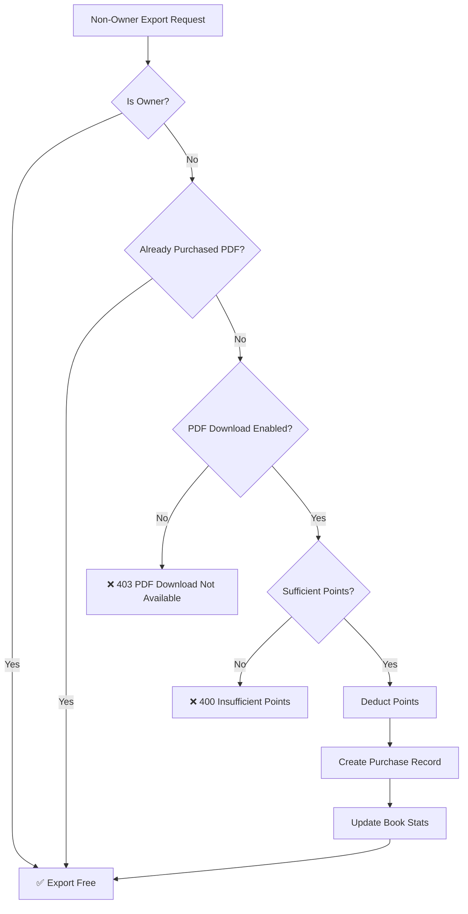

# Book PDF Export Access Control

## Overview

The Book Export API (`POST /api/v1/books/{book_id}/export`) supports both **owner access** (free) and **paid PDF download access** for non-owners.

## Access Control Logic

### 1. Owner Access (Free)
- **Condition**: `user_id == book.user_id`
- **Cost**: Free (no points charged)
- **Formats**: All formats (PDF, DOCX, TXT, HTML)
- **Restrictions**: None

### 2. Non-Owner Paid Access
- **Condition**: User is NOT the book owner
- **Requirements**:
  - Book must have `access_config.download_pdf_points > 0`
  - Book must have `access_config.is_download_enabled = true`
  - User must have sufficient points in balance

#### Payment Flow



## Payment Details

### Points Deduction
- **Amount**: `access_config.download_pdf_points`
- **Timing**: Deducted AFTER access is granted (not before)
- **Balance Check**: Verified before deduction

### Revenue Split
- **Owner Reward**: 80% of points
- **Platform Fee**: 20% of points

Example:
```
PDF Price: 100 points
├── Owner Reward: 80 points (80%)
└── Platform Fee: 20 points (20%)
```

### Purchase Record

Stored in `book_purchases` collection:

```json
{
  "purchase_id": "purchase_abc123...",
  "user_id": "user_123",
  "book_id": "book_456",
  "purchase_type": "pdf_download",
  "points_spent": 100,
  "access_expires_at": null,  // PDF download never expires
  "purchased_at": "2025-11-27T10:30:00Z"
}
```

### Book Stats Updated

```json
{
  "stats": {
    "total_revenue_points": +100,      // Total revenue
    "owner_reward_points": +80,        // Owner's share
    "system_fee_points": +20,          // Platform's share
    "pdf_downloads": +1,               // Count of PDF downloads
    "pdf_revenue": +100                // Revenue from PDFs only
  },
  "community_config": {
    "total_purchases": +1,             // Overall purchase count
    "total_downloads": +1              // Overall download count
  }
}
```

## API Reference

### Endpoint
```
POST /api/v1/books/{book_id}/export
```

### Authentication
**Required**: Firebase JWT token

### Access Requirements
One of the following:
1. User is the book owner (free access)
2. User has purchased PDF access (existing purchase record)
3. User has sufficient points to purchase (new purchase)

### Request Body

```json
{
  "format": "pdf",                    // pdf | docx | txt | html
  "scope": "full_book",               // full_book | selected_chapters
  "chapter_ids": null,                // Array of chapter IDs (if scope=selected_chapters)
  "include_cover": true,              // Include cover page
  "include_toc": true,                // Include table of contents
  "include_metadata": true            // Include book metadata
}
```

### Response (Success)

```json
{
  "success": true,
  "download_url": "https://static.wordai.pro/exports/book_123_1732710600.pdf?...",
  "filename": "My_Book_Title.pdf",
  "file_size": 1024576,
  "format": "pdf",
  "expires_in": 3600,
  "expires_at": "2025-11-27T11:30:00Z",
  "chapters_exported": 12,
  "book_title": "My Book Title"
}
```

### Error Responses

#### 403 - PDF Download Not Available
Book owner disabled PDF downloads or hasn't set a price.

```json
{
  "detail": "PDF download is not available for this book"
}
```

#### 400 - Insufficient Points
User doesn't have enough points to purchase PDF access.

```json
{
  "detail": "Insufficient points. Required: 100 points, Available: 50"
}
```

#### 404 - Book Not Found
```json
{
  "detail": "Book not found"
}
```

## Implementation Notes

### Background Rendering
- **Chapter backgrounds**: Applied to each chapter in exported PDF
- **Book-level background**: Used as default for all chapters
- **Chapter-level override**: Chapter's background_config takes precedence
- **Supported types**:
  - `solid`: Hex color backgrounds
  - `gradient`: Linear, radial, conic gradients with custom angles
  - `theme`: Preset themes (ocean, forest, sunset, newspaper, book_page, etc.)
  - `ai_image`/`custom_image`: Images with overlay support (color + opacity)

### Background CSS Rendering
```python
# Helper function converts BackgroundConfig to inline CSS
def render_background_css(background_config):
    # Solid: background-color: #ff0000
    # Gradient: background: linear-gradient(135deg, #color1, #color2)
    # Theme: Mapped to simplified CSS (e.g., newspaper gets lined pattern)
    # Image: background-image + overlay with background-blend-mode
```

### Purchase Deduplication
- System checks for existing `pdf_download` purchase before charging
- If user already purchased, export is free (no duplicate charge)

### Points Safety
1. **Check balance first**: Verify `points_remaining >= pdf_price`
2. **Deduct atomically**: Use MongoDB `$inc` operation
3. **Create purchase record**: Persist transaction for audit trail
4. **Update stats**: Increment revenue and download counts

### No Expiration
- PDF download purchases **never expire**
- `access_expires_at = null` for pdf_download type
- User can export PDF unlimited times after purchase

## User Experience

### Owner Flow
```
1. Click "Export Book"
2. Select format (PDF)
3. Configure options
4. ✅ Export immediately (free)
```

### Non-Owner First-Time Flow
```
1. Click "Export Book"
2. Select format (PDF)
3. See price: "100 points required"
4. Confirm purchase
5. ✅ Points deducted, export starts
```

### Non-Owner Repeat Flow
```
1. Click "Export Book"
2. Select format (PDF)
3. See: "You own PDF access"
4. ✅ Export immediately (already paid)
```

## Admin Considerations

### Pricing Strategy
- Set `access_config.download_pdf_points` to enable paid exports
- Set to `0` or disable `is_download_enabled` to prevent sales
- Recommended range: 50-500 points depending on book value

### Revenue Tracking
- Monitor `stats.pdf_revenue` for PDF-specific income
- Compare with `stats.total_revenue_points` for overall performance
- Use `stats.pdf_downloads` for popularity metrics

### Refund Policy
- Points are deducted after access is granted (no partial failures)
- Purchase records are permanent (for audit trail)
- Refunds require manual intervention in database

## Security Considerations

1. **Authentication Required**: All exports require valid JWT
2. **Balance Verification**: Check points before deduction
3. **Atomic Operations**: Use MongoDB transactions where possible
4. **Audit Trail**: All purchases logged with timestamps
5. **No Double Charging**: Existing purchase check prevents duplicates

## Testing Scenarios

### Scenario 1: Owner Export (Free)
```bash
# User is book owner
POST /api/v1/books/book_123/export
Authorization: Bearer <owner_token>

# Expected: Export immediately, no points charged
```

### Scenario 2: First-Time Buyer
```bash
# User has 200 points, book costs 100
POST /api/v1/books/book_456/export
Authorization: Bearer <buyer_token>

# Expected:
# - Points: 200 → 100
# - Purchase record created
# - Export starts
```

### Scenario 3: Repeat Buyer
```bash
# User already purchased PDF access
POST /api/v1/books/book_456/export
Authorization: Bearer <buyer_token>

# Expected: Export immediately, no additional charge
```

### Scenario 4: Insufficient Balance
```bash
# User has 50 points, book costs 100
POST /api/v1/books/book_789/export
Authorization: Bearer <poor_user_token>

# Expected: 400 Insufficient Points error
```

### Scenario 5: PDF Download Disabled
```bash
# Book has is_download_enabled = false
POST /api/v1/books/book_999/export
Authorization: Bearer <user_token>

# Expected: 403 PDF Download Not Available
```

## Database Schema Reference

### book_purchases Collection
```javascript
{
  _id: ObjectId,
  purchase_id: String,          // Unique purchase ID
  user_id: String,              // Buyer's Firebase UID
  book_id: String,              // Book being purchased
  purchase_type: String,        // "pdf_download" | "one_time" | "forever"
  points_spent: Number,         // Points paid
  access_expires_at: Date?,     // null for pdf_download
  purchased_at: Date            // Purchase timestamp
}

// Index: { user_id: 1, book_id: 1, purchase_type: 1 }
```

### online_books Collection Updates
```javascript
{
  book_id: String,
  user_id: String,              // Book owner
  access_config: {
    download_pdf_points: Number,    // Price in points
    is_download_enabled: Boolean    // Enable/disable PDF sales
  },
  stats: {
    total_revenue_points: Number,   // All revenue
    owner_reward_points: Number,    // Owner's 80%
    system_fee_points: Number,      // Platform's 20%
    pdf_downloads: Number,          // PDF download count
    pdf_revenue: Number             // PDF-specific revenue
  },
  community_config: {
    total_purchases: Number,        // Overall purchases
    total_downloads: Number         // Overall downloads
  }
}
```

## Changelog

### Version 1.0.0 (2025-11-27)
- ✅ Initial implementation of paid PDF export access
- ✅ Owner always gets free exports
- ✅ Non-owners pay with points on first export
- ✅ Purchase deduplication prevents double charging
- ✅ Revenue split: 80% owner, 20% platform
- ✅ Stats tracking for revenue and downloads
- ✅ No expiration for PDF download purchases
