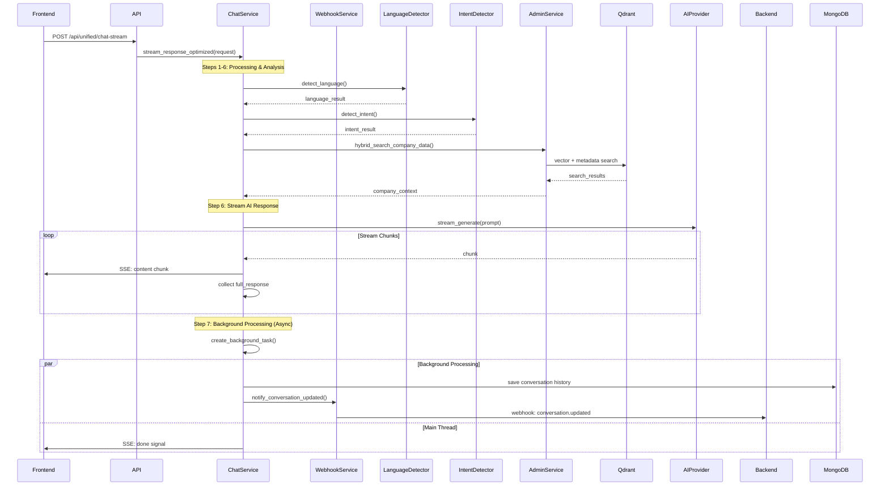

# Phân Tích Chi Tiết Luồng Chat Stream
# Detailed Analysis of Chat Stream Flow

## 📋 Tổng Quan

Tài liệu này phân tích chi tiết luồng xử lý của endpoint `/api/unified/chat-stream` từ khi nhận request đến khi hoàn thành stream và đồng bộ dữ liệu với backend.

## 🔄 8 Bước Xử Lý Chính

### **Bước 1: Nhận Request và Thiết Lập Session**
- **Mô tả**: Nhận request từ frontend và thiết lập session/conversation
- **File**: `src/api/unified_chat_routes.py` → `src/services/unified_chat_service.py`
- **Chi tiết**:
  ```python
  # Tạo session_id nếu chưa có
  session_id = request.session_id or f"{company_id}_{user_id}_{timestamp}"

  # Kiểm tra conversation mới hay cũ
  is_new_conversation = self.is_new_conversation(session_id)
  conversation_id = self.get_or_create_conversation(session_id, company_id)
  ```

### **Bước 2: Webhook - Thông Báo Conversation Mới (Nếu Cần)**
- **Mô tả**: Gửi webhook `conversation.created` nếu đây là conversation mới
- **File**: `src/services/unified_chat_service.py`
- **Chi tiết**:
  ```python
  if is_new_conversation:
      channel = self._get_channel_from_source(request.user_info.source)
      await webhook_service.notify_conversation_created(
          company_id=company_id,
          conversation_id=conversation_id,
          session_id=session_id,
          channel=channel,
          context=request.context,
      )
  ```

### **Bước 3: Webhook - Thông Báo Tin Nhắn User**
- **Mô tả**: Gửi webhook `message.created` cho tin nhắn của user
- **File**: `src/services/unified_chat_service.py`
- **Chi tiết**:
  ```python
  user_message_id = f"msg_{uuid.uuid4()}"
  await webhook_service.notify_message_created(
      company_id=company_id,
      conversation_id=conversation_id,
      message_id=user_message_id,
      role="user",
      content=request.message,
      context=request.context,
  )
  ```

### **Bước 4: Phát Hiện Ngôn Ngữ và Ý Định**
- **Mô tả**: Xác định ngôn ngữ và ý định của user
- **File**:
  - `src/services/language_detector.py`
  - `src/services/intent_detector.py`
- **Chi tiết**:
  ```python
  # Phát hiện ngôn ngữ
  language_result = language_detector.detect_language(request.message)
  response_language = language_detector.get_response_language(
      request.language, language_result.language
  )

  # Phát hiện ý định
  intent_result = await intent_detector.detect_intent(
      message=request.message,
      industry=request.industry,
      company_id=company_id,
      conversation_history=conversation_history,
      context=request.context,
  )
  ```

### **Bước 5: Tìm Kiếm Dữ Liệu Công Ty (Hybrid Search)**
- **Mô tả**: Thực hiện hybrid search để tìm thông tin liên quan từ Qdrant
- **File**:
  - `src/services/unified_chat_service.py` (method `_hybrid_search_company_data`)
  - `src/services/admin_service.py`
- **Chi tiết**:
  ```python
  # Hybrid search kết hợp vector similarity và metadata filtering
  search_results = await self._hybrid_search_company_data(
      company_id=company_id,
      query=request.message,
      limit=3,
      score_threshold=0.2,
  )

  # Kết hợp với company data từ AdminService
  company_context = await self.admin_service.get_company_context(company_id)
  ```

### **Bước 6: Xây Dựng Prompt và Gọi AI Provider**
- **Mô tả**: Tạo prompt chi tiết và gọi AI provider để sinh response
- **File**:
  - Agent-specific files (`src/services/information_agent.py`, `src/services/industry_sales_agents.py`)
  - `src/providers/ai_provider_manager.py`
- **Chi tiết**:
  ```python
  # Routing đến agent phù hợp
  if intent_result.intent == ChatIntent.SALES_INQUIRY:
      agent_stream = self._stream_sales_response(...)
  elif intent_result.intent == ChatIntent.INFORMATION:
      agent_stream = self._stream_information_response(...)
  else:
      agent_stream = self._stream_general_response(...)

  # Agent xây dựng prompt với context và gọi AI
  prompt = f"""
  Context: {search_results}
  Company: {company_context}
  User Query: {request.message}
  Industry: {request.industry}
  """

  # Stream response từ AI provider
  async for chunk in ai_provider.stream_generate(prompt):
      yield chunk
  ```

### **Bước 7: Stream Response Đến Frontend**
- **Mô tả**: Gửi từng chunk của AI response về frontend qua SSE
- **File**: `src/services/unified_chat_service.py`
- **Chi tiết**:
  ```python
  # Stream từng chunk và thu thập full response
  response_content = ""
  async for chunk in agent_stream:
      response_content += chunk
      yield f"data: {json.dumps({'type': 'content', 'chunk': chunk})}\n\n"
  ```

### **Bước 8: Post-Stream Processing và Webhook Finalization**
- **Mô tả**: Sau khi stream xong, lưu dữ liệu và gửi webhook cuối cùng
- **File**: `src/services/unified_chat_service.py`
- **Chi tiết**:
  ```python
  # 8.1: Background processing (async - không block stream)
  asyncio.create_task(
      self._save_and_webhook_async(
          request=request,
          company_id=company_id,
          user_query=user_query,
          ai_response="[Streamed Response]",  # Full response content
      )
  )

  # 8.2: Lưu vào MongoDB và memory (trong background task)
  user_saved = self.conversation_manager.add_message_enhanced(
      user_id=user_id,
      device_id=device_id,
      session_id=session_id,
      role="user",
      content=user_query,
  )

  ai_saved = self.conversation_manager.add_message_enhanced(
      user_id=user_id,
      device_id=device_id,
      session_id=session_id,
      role="assistant",
      content=ai_response,
  )

  # 8.3: Webhook - Thông báo conversation updated (trong background task)
  await webhook_service.notify_conversation_updated(
      company_id=company_id,
      conversation_id=request.session_id,
      status="ACTIVE",
      message_count=2,  # User + AI message
      ended_at=None,
      summary="Enhanced chat flow completed with comprehensive user identification",
  )

  # 8.4: Gửi tín hiệu hoàn thành về frontend
  yield f"data: {json.dumps({'type': 'done'})}\n\n"
  ```

**⚠️ Quan Trọng**:
- Webhook được gửi **sau khi stream hoàn tất**, không trong quá trình streaming
- Background processing đảm bảo webhook không block user experience
- Chỉ có 1 webhook `conversation.updated` cho mỗi successful stream
- Không có webhook `conversation.created` hay `message.created` riêng lẻ trong flow mới

## 🔄 Sequence Diagram



## 📊 Data Flow

### Input Data
```json
{
  "message": "Tôi muốn tìm hiểu về lãi suất vay",
  "company_id": "comp_123456",
  "industry": "banking",
  "user_info": {
    "user_id": "user_123",
    "source": "web_device"
  }
}
```

### Intermediate Processing
1. **Language Detection**: `vietnamese` (confidence: 0.95)
2. **Intent Detection**: `information` (confidence: 0.88)
3. **Hybrid Search Results**: 3 relevant documents from Qdrant
4. **Company Context**: Banking products, policies, contact info

### Output Stream
```
data: {"type": "language", "language": "vietnamese"}

data: {"type": "intent", "intent": "information", "confidence": 0.88}

data: {"type": "content", "chunk": "Chào bạn! "}

data: {"type": "content", "chunk": "Tôi có thể giúp bạn "}

data: {"type": "content", "chunk": "tìm hiểu về lãi suất vay..."}

data: {"type": "done", "session_id": "session_123", "conversation_id": "conv_456"}
```

### Backend Webhooks
1. `conversation.updated` (sau khi stream hoàn tất - trong background task)

**⚠️ Thay Đổi Quan Trọng**:
- Không còn webhook `conversation.created` riêng
- Không còn webhook `message.created` cho từng message
- Chỉ có 1 webhook `conversation.updated` sau khi toàn bộ stream hoàn tất
- Webhook được gửi trong background task, không block user experience

## 🎯 Key Features

### Real-time Experience
- **Streaming**: Response được stream theo chunks để UX mượt mà
- **Background Processing**: Webhook và database saving không block streaming
- **Immediate Feedback**: Frontend nhận được content ngay lập tức

### Data Synchronization
- **Post-Stream Sync**: Webhook được gửi sau khi stream hoàn tất
- **Reliable Delivery**: Retry mechanism đảm bảo webhook delivery
- **Conversation Tracking**: Backend nhận được conversation status cuối cùng

### Intelligent Routing
- **Intent-based**: Routing đến agent phù hợp dựa trên ý định
- **Industry-specific**: Customization theo ngành nghề cụ thể

### Context Awareness
- **Conversation History**: Sử dụng lịch sử chat để tạo response phù hợp
- **Company Data**: Tìm kiếm và sử dụng dữ liệu công ty relevant

## 🔧 Performance Considerations

### Optimization Points
1. **Parallel Processing**: Language và intent detection có thể chạy song song
2. **Caching**: Cache kết quả search và company context
3. **Connection Pooling**: Sử dụng connection pool cho database và AI providers
4. **Background Processing**: Webhook và database operations không block streaming
5. **Async Task Management**: Proper cleanup của background tasks

### Monitoring Metrics
- **Response Time**: Từ request đến first chunk
- **Stream Latency**: Thời gian giữa các chunks
- **Webhook Success Rate**: Tỷ lệ webhook delivery thành công (background monitoring)
- **Error Rates**: Theo dõi lỗi ở từng bước
- **Background Task Health**: Monitor async task completion

## 🛡️ Error Handling

### Graceful Degradation
- **Webhook Failures**: Không ảnh hưởng đến user experience (background processing)
- **AI Provider Errors**: Fallback messages và retry logic
- **Database Issues**: Continue streaming, background tasks handle persistence errors

### Recovery Mechanisms
- **Webhook Retry**: Automatic retry với exponential backoff trong background
- **Session Recovery**: Khôi phục session từ conversation_id
- **Data Consistency**: Ensure data integrity between streaming và background processing
- **Background Task Monitoring**: Health checks cho async operations

## 📈 Future Enhancements

### Planned Improvements
1. **WebSocket Support**: Nâng cấp từ SSE lên WebSocket để hỗ trợ real-time tốt hơn
2. **Message Queuing**: Sử dụng Redis/RabbitMQ cho webhook delivery reliability
3. **AI Model Caching**: Cache model responses cho queries phổ biến
4. **Advanced Analytics**: Real-time conversation analytics và insights
5. **Webhook Dashboard**: Monitoring tool cho webhook health và performance
6. **Smart Background Processing**: Intelligent batching và prioritization của background tasks
History (Lịch sử): "[Lịch sử hội thoại gần nhất được chèn vào đây]..."
Instruction (Yêu cầu): "Hãy trả lời câu hỏi của người dùng một cách thân thiện và chính xác. Câu hỏi là: [tin nhắn của người dùng được chèn vào đây]."
Agent gọi AIProviderManager (ví dụ: self.ai_manager.generate_stream(...)) để gửi prompt này đến nhà cung cấp AI (DeepSeek, OpenAI,...) và yêu cầu một phản hồi streaming.
Bước 6: Gửi Dữ Liệu Streaming Về Client (API Layer)
Hành động: Truyền tải từng "mẩu" phản hồi từ LLM về thẳng giao diện người dùng.
File thực thi: unified_chat_routes.py
Hàm: generate_response() (hàm lồng)
Chi tiết:
Vòng lặp async for chunk in ... trong generate_response() nhận từng chunk (từ hoặc câu) mà LLM trả về ở Bước 5.
Nó ngay lập tức yield chunk này ra ngoài, và StreamingResponse của FastAPI sẽ gửi nó về cho client, tạo ra hiệu ứng gõ chữ real-time.
Bước 7: Kết Thúc và Dọn Dẹp (Service & API Layers)
Hành động: Hoàn tất phiên làm việc, gửi tín hiệu kết thúc và lưu lại lịch sử.
File thực thi: unified_chat_service.py và unified_chat_routes.py
Chi tiết:
Sau khi LLM stream xong, Agent sẽ kết thúc. Hàm stream_response() trong service sẽ yield một tín hiệu kết thúc ("[DONE]").
Client nhận tín hiệu này và biết rằng hội thoại đã hoàn tất.
Hàm stream_response() gọi self._update_conversation_history(...) để lưu lại tin nhắn của người dùng và câu trả lời hoàn chỉnh của AI vào MongoDB.
Kết nối streaming được đóng lại.

---

### **Sơ Đồ Luồng (Đã Sắp Xếp Lại)**

```
Client
  |
  v
[Bước 1: Tiếp Nhận Request]
(unified_chat_routes.py)
  |
  v
[Bước 2: Phân Tích & Thu Thập Ngữ Cảnh]
(unified_chat_service.py)
  |
  v
[Bước 3: Truy Vấn "Bộ Nhớ Dài Hạn"]
(qdrant_company_service.py -> Qdrant DB)
  |
  v
[Bước 4: Định Tuyến & Bắt Đầu Tạo Phản Hồi]
(unified_chat_service.py -> Agent chuyên biệt)
  |
  v
[Bước 5: Gửi Dữ Liệu Streaming Về Client]
(unified_chat_routes.py)
  |
  v
[Bước 6: Kết Thúc Stream & Lưu Lịch Sử]
(unified_chat_service.py -> MongoDB)
  |
  v
Client (Nhận được tín hiệu DONE)
```

Cách trình bày này theo đúng trình tự thực thi của code, hy vọng sẽ giúp bạn dễ hiểu và dễ viết tài liệu hơn.

## 📚 Related Documentation

- [Webhook Conversation Flow](./Webhook-Conversation-Flow.md) - Chi tiết về webhook implementation
- [API Documentation](./API-Documentation.md) - API endpoints và schemas
- [Error Handling Guide](./Error-Handling.md) - Error handling strategies
- [Monitoring & Logging](./Monitoring.md) - System monitoring approach


Chắc chắn rồi! Dưới đây là phân tích chi tiết, từng bước về luồng hoạt động của endpoint `/api/unified/chat-stream`, giúp bạn dễ dàng viết tài liệu và bảo trì.

Phân tích này sẽ đi từ khi request được gửi đến, qua các lớp xử lý, cho đến khi dữ liệu được trả về cho người dùng.

---

### **Tổng Quan Luồng Hoạt Động (High-Level Flow)**

Khi người dùng gửi một tin nhắn đến endpoint `/api/unified/chat-stream`, hệ thống sẽ thực hiện một chuỗi các hành động sau:

1.  **Tiếp Nhận & Xác Thực**: API Route tiếp nhận request, ghi log và chuẩn bị môi trường.
2.  **Phân Tích & Thu Thập Ngữ Cảnh**: `UnifiedChatService` phân tích tin nhắn, xác định ngôn ngữ, ý định (intent) và tìm kiếm thông tin liên quan trong cơ sở dữ liệu vector (Qdrant).
3.  **Định Tuyến Thông Minh (Intelligent Routing)**: Dựa vào ý định, hệ thống sẽ chọn một "Agent" chuyên biệt (Bán hàng, Cung cấp thông tin, hay Chat chung) để xử lý.
4.  **Tạo Phản Hồi Streaming**: Agent được chọn sẽ tạo ra phản hồi dưới dạng một dòng dữ liệu (stream), cho phép hiển thị từng từ hoặc từng câu trên giao diện người dùng.
5.  **Cập Nhật & Kết Thúc**: Sau khi gửi xong phản hồi, hệ thống sẽ cập nhật lịch sử hội thoại và gửi tín hiệu kết thúc stream.

---

### **Phân Tích Chi Tiết Từng Bước**

#### **Bước 1: Tiếp Nhận Request tại API Route (`unified_chat_routes.py`)**

Đây là cửa ngõ đầu tiên của hệ thống.

1.  **Endpoint Definition**:
    -   `@router.post("/api/unified/chat-stream")` định nghĩa một endpoint nhận phương thức `POST`.
    -   Nó nhận vào một đối tượng `UnifiedChatRequest` chứa toàn bộ thông tin từ client (tin nhắn, thông tin người dùng, ID công ty, ngành hàng, v.v.).

2.  **Chuẩn Bị Dữ Liệu**:
    -   **Session ID**: Tự động gán `session_id` bằng `user_info.user_id` nếu client không cung cấp. Điều này đảm bảo mỗi người dùng có một phiên làm việc riêng.
    -   **Logging**: Ghi lại các thông tin quan trọng của request như IP client, ID công ty, ngành, ID người dùng, và nội dung tin nhắn. Đây là bước cực kỳ quan trọng để debug.

3.  **Gọi Service Layer**:
    -   Trọng tâm của hàm này là gọi `unified_chat_service.stream_response(request)`. Toàn bộ logic phức tạp được ủy thác cho `UnifiedChatService`.

4.  **Tạo Streaming Response**:
    -   Hàm `generate_response()` được định nghĩa bên trong để hoạt động như một `AsyncGenerator`.
    -   Vòng lặp `async for chunk in ...` sẽ nhận từng "mẩu" dữ liệu (`chunk`) mà `stream_response` tạo ra.
    -   `yield chunk`: Mỗi `chunk` nhận được sẽ ngay lập tức được gửi về cho client. Đây chính là cơ chế streaming.
    -   **Xử lý lỗi**: Một khối `try...except` được bọc quanh vòng lặp. Nếu có lỗi xảy ra *trong quá trình stream*, nó sẽ `yield` một JSON chứa thông tin lỗi, giúp client có thể xử lý một cách mượt mà.
    -   Cuối cùng, nó trả về một đối tượng `StreamingResponse` của FastAPI với `media_type="text/event-stream"`, là chuẩn cho Server-Sent Events (SSE).

#### **Bước 2: Xử Lý Chính tại Service (`unified_chat_service.py`)**

Đây là bộ não của hệ thống, nơi các quyết định quan trọng được đưa ra.

1.  **Hàm `stream_response()`**:
    -   **Gọi hàm lõi**: Bước đầu tiên và quan trọng nhất, nó gọi `await self._generate_unified_response(...)`. Đây là một thiết kế rất tốt, vì cả endpoint stream và non-stream (`process_message`) đều dùng chung hàm này để thu thập ngữ cảnh và ra quyết định. Điều này giúp giảm lặp code và dễ bảo trì.
    -   **Thu thập kết quả**: Nó nhận về một dictionary chứa tất cả thông tin đã được phân tích: `intent`, `response_language`, `conversation_history`, `company_data`, v.v.

2.  **Định Tuyến (Routing)**:
    -   Dựa vào `intent` đã được xác định, nó thực hiện một chuỗi `if/elif/else` để chọn đúng "Agent" xử lý:
        -   `if intent == ChatIntent.SALES_INQUIRY`: Gọi `_stream_sales_response()`.
        -   `elif intent == ChatIntent.INFORMATION`: Gọi `_stream_information_response()`.
        -   `else` (các trường hợp khác như `SUPPORT`, `GENERAL_CHAT`): Gọi `_stream_general_response()`.
    -   Đây là logic định tuyến cốt lõi, quyết định AI sẽ trả lời theo hướng nào.

3.  **Kết Thúc Stream và Cập Nhật**:
    -   Sau khi agent đã stream xong phản hồi, hàm `stream_response` sẽ `yield "[DONE]"`. Đây là một tín hiệu đặc biệt để báo cho client biết rằng stream đã kết thúc.
    -   Cuối cùng, nó gọi `self._update_conversation_history(...)` để lưu lại tin nhắn của người dùng và phản hồi của AI vào database (MongoDB) và bộ nhớ đệm.

#### **Bước 3: Thu Thập Ngữ Cảnh và Tìm Kiếm Dữ Liệu (`_generate_unified_response` và `_hybrid_search_company_data`)**

Đây là giai đoạn "tư duy" của hệ thống.

1.  **Hàm `_generate_unified_response()`**:
    -   **Lấy lịch sử**: Tải lịch sử hội thoại gần nhất từ MongoDB để hiểu ngữ cảnh.
    -   **Phát hiện ngôn ngữ**: Sử dụng `language_detector` để xác định người dùng đang nói tiếng Việt hay tiếng Anh.
    -   **Phát hiện ý định (Intent Detection)**: Gọi `intent_detector` để phân loại mục đích của tin nhắn (hỏi thông tin, hỏi mua hàng, cần hỗ trợ,...).
    -   **Tìm kiếm Hybrid**: Gọi `_hybrid_search_company_data()` để tìm kiếm dữ liệu liên quan nhất đến câu hỏi của người dùng.

2.  **Hàm `_hybrid_search_company_data()`**:
    -   Đây là một chức năng tìm kiếm nâng cao. Nó không chỉ tìm kiếm dựa trên vector (tìm kiếm theo ngữ nghĩa) mà còn kết hợp lọc theo metadata.
    -   Nó gọi đến `qdrant_service.search_company_data(...)` ở tầng dưới.

#### **Bước 4: Tương Tác với Cơ Sở Dữ Liệu Vector (`qdrant_company_service.py`)**

Đây là nơi hệ thống tương tác với "bộ nhớ dài hạn" của nó.

1.  **Hàm `search_company_data()`**:
    -   **Tạo Query Embedding**: Chuyển đổi câu hỏi của người dùng thành một vector số học bằng mô hình AI.
    -   **Xây dựng Filter**: Tạo một bộ lọc (Filter) để đảm bảo chỉ tìm kiếm trong dữ liệu của đúng `company_id` và đúng `industry`.
    -   **Thực hiện Search**: Gửi yêu cầu tìm kiếm đến Qdrant, bao gồm cả `query_vector` và `query_filter`. Qdrant sẽ trả về các đoạn văn bản (chunks) có nội dung gần nhất với câu hỏi và thỏa mãn điều kiện lọc.
    -   **Định dạng kết quả**: Các kết quả thô từ Qdrant được định dạng lại thành một cấu trúc JSON sạch sẽ trước khi trả về cho service layer.

### **Sơ Đồ Luồng Dữ Liệu (Data Flow Diagram)**

```
Client
  |
  v
[POST /api/unified/chat-stream] in unified_chat_routes.py
  |
  | 1. Ghi log, chuẩn bị StreamingResponse
  v
[unified_chat_service.stream_response()]
  |
  | 2. Gọi hàm phân tích lõi
  v
[unified_chat_service._generate_unified_response()]
  |
  | 3a. Phát hiện Ngôn ngữ & Ý định
  | 3b. Gọi hàm tìm kiếm Hybrid
  v
[unified_chat_service._hybrid_search_company_data()]
  |
  | 4. Gọi Qdrant Service
  v
[qdrant_service.search_company_data()]
  |
  | 5. Tạo embedding, query Qdrant
  v
[Qdrant Database] <--- Trả về dữ liệu liên quan
  |
  | 6. Dữ liệu được trả ngược lên
  v
[unified_chat_service.stream_response()]
  |
  | 7. Định tuyến đến Agent phù hợp (Sales, Info, General)
  v
[Agent chuyên biệt (ví dụ: _stream_information_response)]
  |
  | 8. Tạo phản hồi và `yield` từng chunk
  v
[StreamingResponse in unified_chat_routes.py]
  |
  | 9. Gửi từng chunk về Client
  v
Client
```

Hy vọng phân tích chi tiết này sẽ giúp bạn và đội ngũ dễ dàng hơn trong việc bảo trì và phát triển tính năng chat trong tương lai