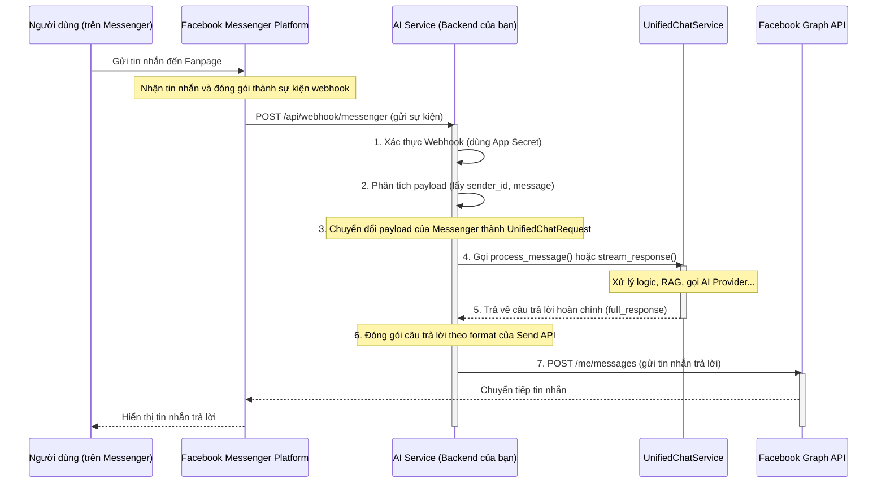

### 📋 **Tổng Quan về Tích Hợp**

Mục tiêu là kết nối Fanpage của công ty với AI Service của bạn. Khi người dùng nhắn tin cho Page, tin nhắn đó sẽ được chuyển đến AI Service để xử lý và câu trả lời sẽ được gửi ngược lại cho người dùng qua Messenger.

**Các thành phần chính bao gồm:**
1.  **Facebook App**: Một ứng dụng trên nền tảng Facebook for Developers để quản lý kết nối và quyền.
2.  **Page Access Token**: Khóa bí mật để AI Service có quyền gửi tin nhắn thay mặt cho Fanpage.
3.  **Webhook**: Cơ chế để Facebook thông báo cho AI Service của bạn mỗi khi có sự kiện mới (như tin nhắn đến).
4.  **API Endpoint mới**: Một endpoint trong AI Service để nhận và xử lý webhook từ Facebook.

---

### 🔄 **Phân Tích Luồng Hoạt Động (Data Flow)**

Đây là luồng xử lý hoàn chỉnh từ khi người dùng gửi tin nhắn đến khi nhận được phản hồi.



**Diễn giải luồng:**
1.  **Xác thực Webhook**: AI Service phải xác thực rằng request đến từ Facebook bằng cách sử dụng `App Secret`.
2.  **Phân tích Payload**: Lấy `sender.id` (ID của người dùng trên Messenger) và `message.text` (nội dung tin nhắn).
3.  **Chuyển đổi Request**: Tạo một object `UnifiedChatRequest` từ thông tin của Messenger. `session_id` có thể chính là `sender.id`.
4.  **Gọi Service**: Gọi `unified_chat_service` để xử lý logic. **Lưu ý quan trọng**: Messenger không hỗ trợ streaming (SSE). Chúng ta cần lấy về **toàn bộ câu trả lời** trước khi gửi đi.
5.  **Nhận Response**: `UnifiedChatService` trả về một object `UnifiedChatResponse` chứa câu trả lời đầy đủ.
6.  **Đóng gói Response**: Tạo một JSON payload theo chuẩn của Messenger Send API, bao gồm `recipient.id` và `message.text`.
7.  **Gửi tin nhắn**: Dùng `Page Access Token` để gọi đến Graph API của Facebook, gửi tin nhắn trả lời cho người dùng.

---

### 🚀 **Kế Hoạch Tích Hợp Chi Tiết**

Đây là các bước cụ thể để triển khai.

#### **Giai đoạn 1: Cấu hình trên Facebook for Developers**

1.  **Tạo Facebook App**:
    *   Truy cập [Facebook for Developers](https://developers.facebook.com/).
    *   Tạo một App mới với loại là "Business".
    *   Trong App Dashboard, tìm sản phẩm "Messenger" và thêm vào App của bạn.
2.  **Kết nối Fanpage**:
    *   Trong mục "Messenger Platform Settings", chọn Fanpage bạn muốn tích hợp.
    *   Cấp quyền `pages_messaging` và `pages_show_list` cho App.
3.  **Tạo Page Access Token**:
    *   Vẫn trong mục cài đặt Messenger, tạo một "Page Access Token". Token này sẽ được dùng trong AI Service.
4.  **Lấy App Secret**:
    *   Vào `Settings -> Basic`, lấy `App Secret`.
5.  **Cấu hình Webhook**:
    *   Trong mục "Webhooks", nhấn "Add Callback URL".
    *   **Callback URL**: Sẽ là URL của endpoint mới trên AI Service của bạn (ví dụ: `https://ai.aimoney.io.vn/api/webhook/messenger`).
    *   **Verify Token**: Tạo một chuỗi bí mật ngẫu nhiên (ví dụ: `my_super_secret_verify_token`). Token này chỉ dùng một lần để xác thực URL.
    *   **Subscribe to Events**: Chọn `messages` để nhận sự kiện tin nhắn mới.

#### **Giai đoạn 2: Cập nhật Backend (AI Service)**

1.  **Cập nhật file .env**:
    Thêm các biến môi trường mới để lưu trữ key.

    ````plaintext
    // filepath: /Users/user/Code/ai-chatbot-rag/.env
    // ...existing code...
    # Messenger Integration
    MESSENGER_PAGE_ACCESS_TOKEN=your_page_access_token_from_facebook
    MESSENGER_APP_SECRET=your_app_secret_from_facebook
    MESSENGER_VERIFY_TOKEN=your_custom_verify_token
    ````

2.  **Tạo Messenger Service**:
    Tạo một file mới để quản lý việc tương tác với Messenger API, giúp code sạch sẽ hơn.

    ````python
    // filepath: /Users/user/Code/ai-chatbot-rag/src/services/messenger_service.py
    import os
    import httpx
    from src.utils.logger import setup_logger

    logger = setup_logger()

    class MessengerService:
        def __init__(self):
            self.page_access_token = os.getenv("MESSENGER_PAGE_ACCESS_TOKEN")
            self.graph_api_url = "https://graph.facebook.com/v19.0/me/messages"
            if not self.page_access_token:
                logger.warning("⚠️ MESSENGER_PAGE_ACCESS_TOKEN is not set. Messenger integration will not work.")

        async def send_text_message(self, recipient_id: str, message_text: str):
            """Sends a text message to a Messenger user."""
            if not self.page_access_token:
                logger.error("❌ Cannot send message: Page Access Token is missing.")
                return

            payload = {
                "recipient": {"id": recipient_id},
                "message": {"text": message_text},
                "messaging_type": "RESPONSE"
            }
            params = {"access_token": self.page_access_token}

            async with httpx.AsyncClient() as client:
                try:
                    response = await client.post(self.graph_api_url, json=payload, params=params)
                    response.raise_for_status()
                    logger.info(f"✅ Sent message to Messenger user {recipient_id}")
                except httpx.HTTPStatusError as e:
                    logger.error(f"❌ Failed to send message to Messenger: {e.response.status_code} - {e.response.text}")
                except Exception as e:
                    logger.error(f"❌ An unexpected error occurred while sending message: {e}")

    messenger_service = MessengerService()
    ````

3.  **Tạo Endpoint Webhook mới**:
    Thêm một file route mới hoặc thêm vào unified_chat_routes.py để xử lý webhook từ Messenger.

    ````python
    // filepath: /Users/user/Code/ai-chatbot-rag/src/api/messenger_webhook_routes.py
    import os
    import hmac
    import hashlib
    from fastapi import APIRouter, Request, Response, HTTPException, Header
    from typing import Dict, Any

    from src.services.unified_chat_service import unified_chat_service
    from src.services.messenger_service import messenger_service
    from src.models.unified_models import UnifiedChatRequest, UserInfo, UserSource, Industry
    from src.utils.logger import setup_logger

    logger = setup_logger()
    router = APIRouter()

    VERIFY_TOKEN = os.getenv("MESSENGER_VERIFY_TOKEN")
    APP_SECRET = os.getenv("MESSENGER_APP_SECRET")

    async def verify_signature(request: Request):
        """Verify that the request is from Facebook."""
        signature = request.headers.get("x-hub-signature-256")
        if not signature:
            raise HTTPException(status_code=403, detail="Missing X-Hub-Signature-256 header")

        body = await request.body()
        expected_signature = "sha256=" + hmac.new(APP_SECRET.encode(), body, hashlib.sha256).hexdigest()

        if not hmac.compare_digest(expected_signature, signature):
            raise HTTPException(status_code=403, detail="Invalid signature")

    @router.get("/api/webhook/messenger")
    async def verify_webhook(request: Request):
        """Handles webhook verification for Facebook."""
        mode = request.query_params.get("hub.mode")
        token = request.query_params.get("hub.verify_token")
        challenge = request.query_params.get("hub.challenge")

        if mode == "subscribe" and token == VERIFY_TOKEN:
            logger.info("✅ Messenger Webhook verified successfully!")
            return Response(content=challenge, status_code=200)
        else:
            logger.error("❌ Messenger Webhook verification failed.")
            raise HTTPException(status_code=403, detail="Verification failed")

    @router.post("/api/webhook/messenger")
    async def handle_messenger_webhook(request: Request):
        """Handles incoming messages from Messenger."""
        await verify_signature(request)
        data = await request.json()

        if data.get("object") == "page":
            for entry in data.get("entry", []):
                for event in entry.get("messaging", []):
                    if event.get("message") and not event["message"].get("is_echo"):
                        sender_id = event["sender"]["id"]
                        message_text = event["message"]["text"]

                        # Process the message in the background
                        await process_incoming_message(sender_id, message_text)

        return Response(status_code=200)

    async def process_incoming_message(sender_id: str, message_text: str):
        """Converts Messenger event to UnifiedChatRequest and gets a response."""
        try:
            logger.info(f"📨 Received message from Messenger user {sender_id}: '{message_text}'")

            # Assume a default company_id or determine it based on the page
            # This needs to be configured based on your business logic
            company_id = "comp_123456" # Replace with your logic

            chat_request = UnifiedChatRequest(
                message=message_text,
                company_id=company_id,
                industry=Industry.OTHER, # Or detect based on page
                session_id=f"messenger_{sender_id}",
                user_info=UserInfo(
                    user_id=f"messenger_{sender_id}",
                    source=UserSource.FACEBOOK_MESSENGER
                )
            )

            # IMPORTANT: Call a NON-STREAMING method to get the full response
            # Let's assume a method `process_message` exists for this.
            response = await unified_chat_service.process_message(chat_request)

            ai_response_text = response.message

            # Send the response back to the user
            await messenger_service.send_text_message(sender_id, ai_response_text)

        except Exception as e:
            logger.error(f"❌ Error processing Messenger message for {sender_id}: {e}")
            # Optionally, send an error message back to the user
            await messenger_service.send_text_message(sender_id, "Sorry, I encountered an error. Please try again later.")

    ````

4.  **Tích hợp Router mới vào `main.py`**:
    Đảm bảo router mới được ứng dụng FastAPI của bạn biết đến.

    ````python
    // filepath: /Users/user/Code/ai-chatbot-rag/main.py
    // ...existing code...
    from src.api import unified_chat_routes, messenger_webhook_routes

    # ...existing code...
    app.include_router(unified_chat_routes.router)
    app.include_router(messenger_webhook_routes.router) # Add this line
    // ...existing code...
    ````

#### **Giai đoạn 3: Triển khai và Kiểm thử**

1.  **Deploy**: Deploy phiên bản code mới đã cập nhật lên server.
2.  **Xác thực Webhook**: Truy cập Facebook App, vào mục Webhook và nhấn "Verify and Save". Facebook sẽ gửi một request `GET` đến endpoint của bạn. Nếu thành công, URL sẽ được lưu.
3.  **Kiểm thử End-to-End**:
    *   Mở Fanpage và gửi một tin nhắn.
    *   Kiểm tra log của AI Service để xem tin nhắn có được nhận và xử lý không.
    *   Kiểm tra xem bạn có nhận được tin nhắn trả lời trên Messenger không.
    *   Thử các kịch bản khác nhau để đảm bảo logic hoạt động chính xác.