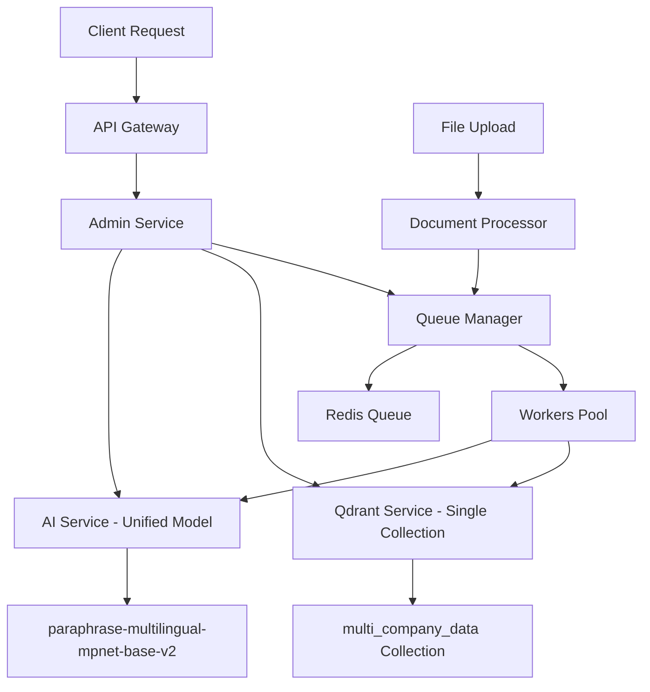
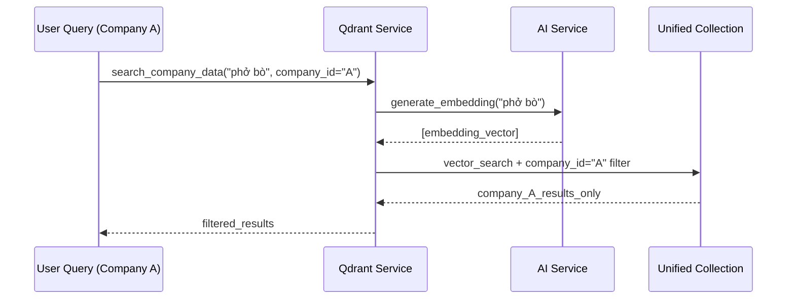
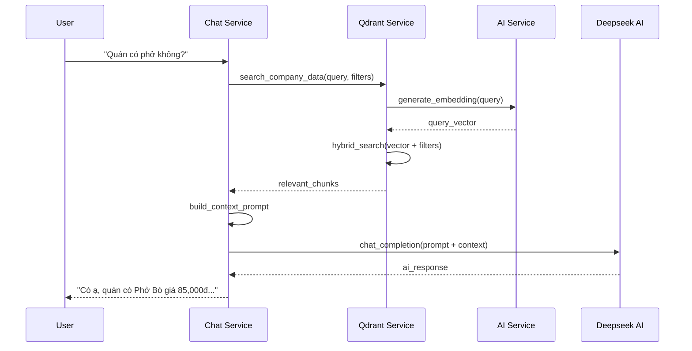

# AI-RAG System Architecture Documentation
# Tài liệu Kiến trúc Hệ thống AI-RAG

Phiên bản: 3.0 | Ngày cập nhật: July 22, 2025

---

## 🏗️ **Tổng quan Kiến trúc (Architecture Overview)**

Hệ thống AI-RAG được thiết kế theo kiến trúc microservices với 4 thành phần chính:

1. **Unified AI Service** - Dịch vụ AI tập trung cho embedding (768 dimensions)
2. **Multi-Tenant Qdrant Service** - Quản lý dữ liệu vector trong single collection  
3. **Redis Queue Manager** - Xử lý bất đồng bộ tasks và document processing
4. **Data Processing Pipeline** - Xử lý và upload dữ liệu qua queue system



---

## 🧠 **1. Unified AI Service (ai_service.py)**

### **Mục đích:**
- Tập trung hóa việc tạo embedding cho toàn bộ hệ thống
- Sử dụng model `paraphrase-multilingual-mpnet-base-v2` (768 dimensions)
- Hỗ trợ đa ngôn ngữ (Việt, Anh, Trung, Nhật, Hàn, v.v.)

### **Thành phần chính:**

#### **UnifiedAIService Class:**
```python
class UnifiedAIService:
    def __init__(self):
        self.embedder = SentenceTransformer("paraphrase-multilingual-mpnet-base-v2")
        self.vector_size = 768
    
    async def generate_embedding(self, text: str) -> List[float]
    async def generate_embeddings_batch(self, texts: List[str]) -> List[List[float]]
    async def calculate_similarity(self, text1: str, text2: str) -> float
    async def health_check(self) -> Dict[str, Any]
```

#### **Các tính năng:**
- ✅ **Single Text Embedding**: Tạo embedding cho 1 văn bản
- ✅ **Batch Processing**: Xử lý nhiều văn bản cùng lúc
- ✅ **Similarity Calculation**: Tính độ tương đồng ngữ nghĩa
- ✅ **Health Check**: Kiểm tra trạng thái hoạt động
- ✅ **Error Handling**: Xử lý lỗi toàn diện

### **Cấu hình:**
```bash
# development.env
EMBEDDING_MODEL=paraphrase-multilingual-mpnet-base-v2
VECTOR_SIZE=768
```

---

## 🗄️ **2. Multi-Tenant Qdrant Service (qdrant_company_service.py)**

### **Mục đích:**
- **SINGLE COLLECTION ARCHITECTURE**: Sử dụng 1 collection duy nhất `multi_company_data` cho tất cả công ty
- **Multi-Tenant Filtering**: Phân biệt dữ liệu công ty qua `company_id` filter
- **Qdrant Free Plan Optimization**: Tối ưu cho giới hạn 1 collection của Qdrant free plan
- Thực hiện tìm kiếm lai (Hybrid Search) với filter metadata nâng cao

### **Kiến trúc Single Collection:**

#### **A. Unified Collection Management:**
```python
class QdrantCompanyDataService:
    def __init__(self):
        # QUAN TRỌNG: Chỉ sử dụng 1 collection cho tất cả công ty
        self.unified_collection_name = "multi_company_data"
        
async def initialize_company_collection(company_config: CompanyConfig) -> str:
    # 1. Luôn trả về unified collection name
    # 2. Tạo collection nếu chưa tồn tại với vector size 768
    # 3. Tạo payload indexes cho multi-tenant filtering
    # 4. Cache company info trong self.company_collections
    return "multi_company_data"
```

**Single Collection Benefits:**
- ✅ **Free Plan Compatible**: Phù hợp với giới hạn 1 collection của Qdrant free
- ✅ **Cost Effective**: Không cần multiple collections
- ✅ **Unified Management**: Quản lý tập trung dễ dàng
- ✅ **Cross-Company Search**: Có thể search cross-company nếu cần

**Multi-Tenant Payload Indexes:**
- `company_id`: **keyword index** (PRIMARY FILTER)
- `industry`: keyword index  
- `data_type`: keyword index (PRODUCTS, SERVICES, FAQ, etc.)
- `language`: keyword index (vi, en, auto_detect)
- `file_id`: keyword index
- `created_at`: datetime index

#### **B. Multi-Tenant Data Storage:**
```python
async def add_document_chunks(chunks: List[QdrantDocumentChunk]) -> Dict:
    # 1. Generate embeddings using Unified AI Service
    # 2. Create PointStruct với company_id trong payload
    # 3. Upsert to unified collection "multi_company_data"
```

**Point Structure in Unified Collection:**
```json
{
  "id": "company1_chunk_123",
  "vector": [768-dimensional embedding],
  "payload": {
    "company_id": "golden-dragon-test",  // PRIMARY FILTER
    "data_type": "PRODUCTS",
    "language": "vi",
    "content_for_embedding": "Optimized text for AI",
    "structured_data": {"name": "Phở Bò", "price": 85000},
    "file_id": "file_123",
    "industry": "restaurant",
    "created_at": "2025-07-22T10:00:00Z"
  }
}
```

#### **C. Multi-Tenant Hybrid Search:**
```python
async def search_company_data(
    company_id: str,
    query: str,
    data_types: Optional[List[IndustryDataType]] = None,
    language: Language = Language.VIETNAMESE
) -> List[Dict]:
    # 1. Generate query embedding với Unified AI Service
    # 2. Build COMPANY-SPECIFIC filter conditions
    # 3. Execute vector search trên unified collection
    # 4. Return filtered results cho company này
```

**Enhanced Multi-Tenant Filter Strategy:**
- **MUST conditions** (bắt buộc):
  - `company_id` = current company (**ISOLATION KEY**)
  - `industry` = company industry
  - `language` = detected/specified language
  
- **SHOULD conditions** (ưu tiên):
  - `data_type` IN [PRODUCTS, SERVICES, FAQ]

**Multi-Tenant Search Flow:**


#### **D. Multi-Tenant Data Management:**
```python
async def delete_company_data(company_id: str, file_ids: List[str] = None):
    # Delete data cho company cụ thể từ unified collection
    filter_condition = Filter(
        must=[
            FieldCondition(key="company_id", match=MatchValue(value=company_id))
        ]
    )
    
async def get_company_data_stats(company_id: str) -> CompanyDataStats:
    # Get statistics cho company cụ thể từ unified collection
    filter_condition = Filter(
        must=[
            FieldCondition(key="company_id", match=MatchValue(value=company_id))
        ]
    )
```

---

## 📁 **3. File Upload & Processing Flow**

### **A. File Upload Process:**

#### **Step 1: File Upload API**
```python
POST /api/admin/companies/{company_id}/files/upload
{
    "r2_url": "https://static.agent8x.io.vn/...",
    "data_type": "document|products|services",
    "industry": "restaurant",
    "metadata": {...},
    "upload_to_qdrant": true
}
```

#### **Step 2: Document Processing**
```python
# src/workers/document_processor.py
class AIDocumentProcessor:
    def __init__(self):
        self.embedder = SentenceTransformer("paraphrase-multilingual-mpnet-base-v2")
    
    async def process_file():
        # 1. Download from R2
        # 2. Extract text content
        # 3. Create semantic chunks
        # 4. Generate embeddings
        # 5. Upload to Qdrant
```

#### **Step 3: Chunk Creation**
```python
# Chunking Strategy:
- Company Info: 1 chunk cho toàn bộ thông tin
- Documents: Semantic chunking theo paragraph
- Products/Services: 1 chunk per item
- Images: 1 chunk với description
```

### **B. Content for Embedding Optimization:**

#### **Cấu trúc QdrantDocumentChunk:**
```python
@dataclass
class QdrantDocumentChunk:
    chunk_id: str
    company_id: str
    content: str  # Raw content
    content_for_embedding: str  # Optimized for AI
    structured_data: Dict  # JSON data
    data_type: IndustryDataType
    language: Language
    # ... other fields
```

#### **Content Optimization Examples:**
- **Products**: "Tên sản phẩm: Phở Bò. Mô tả: Nước dùng đậm đà. Giá: 85,000 VND."
- **Services**: "Dịch vụ: Giao hàng tận nơi. Miễn phí trong bán kính 5km."
- **Company Info**: "Nhà hàng Golden Dragon chuyên ẩm thực Việt tại 123 Nguyễn Huệ..."

---

## 🔍 **4. Search & Retrieval Flow**

### **A. User Query Processing:**



### **B. Context Building:**
```python
def build_rag_context(search_results: List[Dict]) -> str:
    context_parts = []
    for result in search_results:
        # Use content_for_embedding for optimal AI reading
        context_parts.append(result["content_for_rag"])
    
    return "\n".join(context_parts)
```

### **C. Final Prompt Structure:**
```
Bạn là trợ lý của {company_name}. Dựa vào thông tin sau:

--- NGỮ CẢNH ---
Tên sản phẩm: Phở Bò. Mô tả: Nước dùng đậm đà. Giá: 85,000 VND.
Dịch vụ: Giao hàng tận nơi. Miễn phí trong bán kính 5km.
--- HẾT NGỮ CẢNH ---

Câu hỏi: "Quán có phở không?"
```

---

## ⚙️ **5. Configuration & Deployment**

### **A. Environment Variables:**
```bash
# AI Configuration
EMBEDDING_MODEL=paraphrase-multilingual-mpnet-base-v2
VECTOR_SIZE=768

# Qdrant Configuration
QDRANT_URL=https://your-qdrant-cloud-url
QDRANT_API_KEY=your-api-key

# AI Providers
DEEPSEEK_API_KEY=your-deepseek-key
CHATGPT_API_KEY=your-openai-key
DEFAULT_AI_PROVIDER=deepseek
```

### **B. Service Dependencies:**
```python
# Service Initialization Order:
1. UnifiedAIService (ai_service.py)
2. QdrantCompanyDataService (qdrant_company_service.py)  
3. DocumentProcessor (document_processor.py)
4. API Routes & Chat Services
```

### **C. Performance Optimizations:**
- ✅ **Singleton Pattern**: AI Service instance được cache
- ✅ **Batch Processing**: Multiple embeddings cùng lúc
- ✅ **Collection Caching**: Company collections được cache
- ✅ **Async Processing**: Non-blocking operations
- ✅ **Index Optimization**: Payload fields được index

---

## 🐛 **6. Debugging Guide**

### **A. Common Issues & Solutions:**

#### **Vector Size Mismatch:**
```bash
# Error: Expected 768 but got 384
# Solution: Check EMBEDDING_MODEL and VECTOR_SIZE config
```

#### **Embedding Generation Fails:**
```python
# Check AI Service health:
ai_service = get_ai_service()
health = await ai_service.health_check()
print(health)
```

#### **Search Returns No Results:**
```python
# Debug search filters:
1. Check company_id exists in collection
2. Verify data_type values
3. Test language filtering
4. Check score_threshold (default 0.7)
```

### **B. Logging & Monitoring:**
```python
# Enable debug logging:
import logging
logging.getLogger("sentence_transformers").setLevel(logging.DEBUG)
```

### **C. Collection Inspection:**
```python
# Get collection info:
collection_info = qdrant_client.get_collection("restaurant_golden_dragon")
print(f"Points: {collection_info.points_count}")

# Browse points:
points = qdrant_client.scroll("restaurant_golden_dragon", limit=10)
```

---

## 📊 **7. Performance Metrics**

### **A. Expected Performance:**
- **Embedding Generation**: ~50ms per text
- **Batch Embedding**: ~200ms for 10 texts
- **Vector Search**: ~10-50ms depending on collection size
- **End-to-end Query**: ~300-500ms

### **B. Scalability:**
- **Collections**: Unlimited (one per company)
- **Points per Collection**: 10M+ (Qdrant limitation)
- **Concurrent Requests**: Limited by server resources
- **Languages**: 15+ supported by the model

---

## 🔄 **8. Testing & Validation**

### **A. Unit Tests:**
```bash
# Test AI Service:
python -m pytest tests/test_ai_service.py

# Test Qdrant Service:
python -m pytest tests/test_qdrant_service.py

# Integration Test:
python tests/test_complete_admin_workflow.py
```

### **B. Manual Testing:**
```bash
# Start server:
python serve.py

# Run workflow test:
cd tests && python test_complete_admin_workflow.py
```

---

**Lưu ý quan trọng:** Tài liệu này cần được cập nhật khi có thay đổi về kiến trúc hoặc cấu hình hệ thống.
