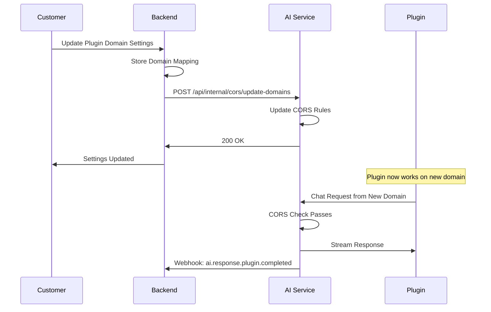

# Webhook Integration Guide Updates
*Updated: 2025-01-31*

## 📋 **Summary of Changes**

Updated `docs/integration/Backend-Webhook-Integration-Guide.md` to include chat-plugin support, dynamic CORS handling, and differentiated webhook events for frontend vs backend channels.

## 🆕 **New Features Added**

### **1. Chat Plugin Channel Support**
- **Channel**: `chat-plugin` - Website chat widget embedded trên domain của khách hàng
- **Request Source**: Browser của khách hàng (domain khác với AI Service)
- **CORS Requirement**: Dynamic CORS configuration cho từng `pluginId` → `domain` → `companyId`

### **2. Dynamic CORS Management**
- AI Service cần allow CORS từ customer domains
- Backend quản lý mapping: `pluginId` ↔ `allowedDomains` ↔ `companyId`
- Real-time CORS updates khi customer thay đổi domain

### **3. New Webhook Events**

#### **AI Response Completed (Backend Channels)**
```json
{
  "event": "ai.response.completed",
  "data": {
    "channel": "messenger|instagram|whatsapp|zalo",
    "response": "AI response content",
    "processingTime": 2.3
  }
}
```

#### **AI Response Plugin Completed (Frontend Channels)**
```json
{
  "event": "ai.response.plugin.completed",
  "data": {
    "channel": "chatdemo|chat-plugin",
    "pluginId": "plugin_123",
    "customerDomain": "https://customer-website.com",
    "response": "AI response content",
    "metadata": {
      "streaming": true
    }
  }
}
```

### **4. Channel Routing Differences**

#### **Frontend Channels** (chatdemo, chat-plugin)
- **Flow**: Browser Request → AI Stream Response → Backend Callback
- **User Experience**: Real-time streaming trong browser
- **Webhook**: `ai.response.plugin.completed` sau khi streaming xong
- **CORS**: Required cho chat-plugin từ customer domains

#### **Backend Channels** (messenger, instagram, whatsapp, zalo)
- **Flow**: Platform Webhook → AI Process → Platform Response
- **User Experience**: Traditional request-response
- **Webhook**: `ai.response.completed` sau khi response được gửi
- **CORS**: Not required (server-to-server communication)

## 🏗️ **Backend Implementation Requirements**

### **New Database Table**
```sql
CREATE TABLE plugin_domains (
    id INT AUTO_INCREMENT PRIMARY KEY,
    plugin_id VARCHAR(255) NOT NULL,
    company_id VARCHAR(255) NOT NULL,
    allowed_domains JSON NOT NULL,
    is_active BOOLEAN DEFAULT TRUE,
    created_at TIMESTAMP DEFAULT CURRENT_TIMESTAMP,
    updated_at TIMESTAMP DEFAULT CURRENT_TIMESTAMP ON UPDATE CURRENT_TIMESTAMP,

    UNIQUE KEY unique_plugin (plugin_id),
    INDEX idx_company_id (company_id),
    INDEX idx_active (is_active)
);
```

### **Required Endpoints**

#### **CORS Domain Query (for AI Service)**
```http
GET /api/cors/plugin-domains?pluginId={pluginId}
```

#### **Plugin Domain Management**
```http
POST /api/plugins/{pluginId}/domains
```

### **Webhook Event Handling**
- Update webhook handlers to support new event types
- Add processing logic for `ai.response.completed` and `ai.response.plugin.completed`
- Store plugin-specific metadata (pluginId, customerDomain)

## 🔄 **CORS Management Flow**



## 🧪 **Test Examples Added**

### **Chat Plugin Response Test**
```bash
curl -X POST http://localhost:8001/api/webhooks/ai/conversation \
  -H "Content-Type: application/json" \
  -H "X-Webhook-Source: ai-service" \
  -H "X-Webhook-Secret: your-webhook-secret" \
  -d '{
    "event": "ai.response.plugin.completed",
    "data": {
      "channel": "chat-plugin",
      "pluginId": "plugin_123",
      "customerDomain": "https://customer-website.com"
    }
  }'
```

### **CORS Domain Tests**
```bash
# Query domains
curl -X GET "http://localhost:8001/api/cors/plugin-domains?pluginId=plugin_123"

# Update domains
curl -X POST http://localhost:8001/api/plugins/plugin_123/domains \
  -d '{"domains": ["https://customer-website.com"], "companyId": "comp_456"}'
```

## ✅ **Implementation Checklist**

### **Backend Changes**
- [ ] Add `plugin_domains` table to database
- [ ] Implement `/api/cors/plugin-domains` endpoint
- [ ] Implement `/api/plugins/{pluginId}/domains` endpoint
- [ ] Update webhook handlers for new event types
- [ ] Add CORS notification to AI Service

### **AI Service Changes**
- [x] Implement dynamic CORS middleware
- [x] Add `/api/internal/cors/update-domains` endpoint
- [x] Update webhook payload generation
- [ ] Test CORS with customer domains

### **Documentation Updates**
- [x] Update Backend-Webhook-Integration-Guide.md
- [x] Add chat-plugin webhook events
- [x] Document CORS management flow
- [x] Add test examples
- [x] Update database schema

## 🎯 **Key Benefits**

1. **Unified Channel Handling**: Clear distinction between frontend vs backend channels
2. **Dynamic CORS**: Support for chat plugins on customer domains
3. **Comprehensive Webhooks**: All AI responses tracked with appropriate metadata
4. **Better Documentation**: Clear examples and implementation guides
5. **Scalable Architecture**: Easy to add new channels or modify existing ones

## 📚 **Related Documents**

- `docs/Channel-Routing-Test.md` - Channel routing logic và validation rules
- `src/models/unified_models.py` - Channel-source auto-mapping implementation
- `src/services/unified_chat_service.py` - Channel routing service logic
- `test_channel_source_mapping.py` - Comprehensive channel mapping tests
