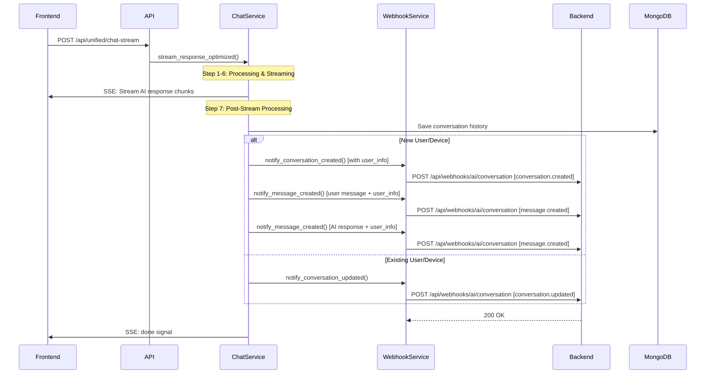

# Tài Liệu Webhook Conversation Flow
# Webhook Conversation Flow Documentation

## 📋 Tổng Quan

Tài liệu này mô tả chi tiết luồng webhook cho conversation trong hệ thống AI Chatbot RAG, bao gồm logic phân biệt user mới/cũ, thời điểm gửi webhook, payload structure và error handling.

## 🔄 Luồng Webhook Logic Mới

### **Nguyên Tắc Chính**
- **Webhook chỉ được gửi SAU KHI stream xong**, không trong quá trình streaming
- **User mới**: gửi `conversation.created` + 2x `message.created` (user + AI)
- **User cũ**: chỉ gửi `conversation.updated`
- **Tất cả webhook đều bao gồm user info** (`user_id`, `device_id`, `source`, `name`, `email`)

### **Flow Tổng Quan**



## 🎯 Thời Điểm Gửi Webhook

### **1. Sau Khi Stream Hoàn Tất (Post-Stream Processing)**

**Timing**: Webhook được gửi **sau khi** AI đã stream xong response và **trước khi** gửi tín hiệu `done` về frontend.

**Location**: `src/services/unified_chat_service.py` → `_save_complete_conversation_async()`

**Trigger**: Được gọi trong background task sau khi streaming hoàn tất

```python
# Step 7: Background tasks (async save and webhook)
asyncio.create_task(
    self._save_complete_conversation_async(
        request=request,
        company_id=company_id,
        user_query=user_query,
        ai_response=full_ai_response,  # Full response sau khi stream xong
    )
)
```

### **2. Logic Phân Biệt User Mới/Cũ**

**Kiểm tra User Status**:
```python
# Check if user/device exists in system
existing_messages = self.conversation_manager.get_optimized_messages_for_frontend(
    user_id=user_id,
    device_id=device_id,
    session_id=session_id,
)
is_new_user = not existing_messages or len(existing_messages) == 0
```

**🆕 User Mới (Chưa có trong hệ thống)**:
```python
# 1. conversation.created (with user_info)
await webhook_service.notify_conversation_created(...)

# 2. message.created cho user message (with user_info)
await webhook_service.notify_message_created(role="user", ...)

# 3. message.created cho AI response (with user_info)
await webhook_service.notify_message_created(role="assistant", ...)
```

**🔄 User Cũ (Đã có trong hệ thống)**:
```python
# Chỉ gửi conversation.updated
await webhook_service.notify_conversation_updated(...)
```

### **3. Không Có Webhook Trong Quá Trình Stream**

❌ **Không gửi webhook khi:**
- Đang stream chunks
- Phát hiện ngôn ngữ/ý định
- Tìm kiếm dữ liệu company

✅ **Chỉ gửi webhook khi:**
- Stream đã hoàn tất
- Đã lưu conversation history
- Đã xác định user status (new/existing)
- Chuẩn bị gửi tín hiệu done

## 📤 Webhook Payload Structure

### **Event Type: `conversation.created` (User Mới)**

```json
{
  "event": "conversation.created",
  "companyId": "comp_123456",
  "data": {
    "conversationId": "session_abc123_user456",
    "sessionId": "session_abc123_user456",
    "channel": "WEB",
    "intent": null,
    "startedAt": "2025-08-03T10:30:42.123Z",
    "metadata": {},
    "userInfo": {
      "user_id": "2Fi60Cy2jHcMhkn5o2VcjfUef7p2",
      "device_id": "web_device_a1b2c3d4e5f6",
      "source": "web_device",
      "name": "Nguyễn Văn A",
      "email": "nguyen.van.a@example.com"
    }
  },
  "timestamp": "2025-08-03T10:30:42.123Z",
  "metadata": {}
}
```

### **Event Type: `message.created` (User Message)**

```json
{
  "event": "message.created",
  "companyId": "comp_123456",
  "data": {
    "messageId": "msg_user_abc123",
    "conversationId": "session_abc123_user456",
    "role": "user",
    "content": "Tôi muốn tìm hiểu về lãi suất vay thế chấp của ngân hàng",
    "timestamp": "2025-08-03T10:30:42.123Z",
    "metadata": {},
    "userInfo": {
      "user_id": "2Fi60Cy2jHcMhkn5o2VcjfUef7p2",
      "device_id": "web_device_a1b2c3d4e5f6",
      "source": "web_device",
      "name": "Nguyễn Văn A",
      "email": "nguyen.van.a@example.com"
    }
  },
  "timestamp": "2025-08-03T10:30:42.123Z",
  "metadata": {}
}
```

### **Event Type: `message.created` (AI Response)**

```json
{
  "event": "message.created",
  "companyId": "comp_123456",
  "data": {
    "messageId": "msg_ai_def456",
    "conversationId": "session_abc123_user456",
    "role": "assistant",
    "content": "Chào anh Nguyễn Văn A! Tôi rất vui được hỗ trợ anh tìm hiểu về lãi suất vay thế chấp. Hiện tại, các ngân hàng đang áp dụng lãi suất vay thế chấp dao động từ 6.5% - 12%/năm tùy thuộc vào:\n\n1. **Thời gian vay**: Từ 5-25 năm\n2. **Tỷ lệ cho vay**: Tối đa 70-85% giá trị tài sản\n3. **Thu nhập**: Cần chứng minh thu nhập ổn định\n4. **Tài sản đảm bảo**: Căn hộ, nhà riêng, đất...\n\nAnh có muốn tôi tư vấn cụ thể cho trường hợp nào không?",
    "timestamp": "2025-08-03T10:30:45.789Z",
    "metadata": {},
    "userInfo": {
      "user_id": "2Fi60Cy2jHcMhkn5o2VcjfUef7p2",
      "device_id": "web_device_a1b2c3d4e5f6",
      "source": "web_device",
      "name": "Nguyễn Văn A",
      "email": "nguyen.van.a@example.com"
    }
  },
  "timestamp": "2025-08-03T10:30:45.789Z",
  "metadata": {}
}
```

### **Event Type: `conversation.updated` (User Cũ)**

```json
{
  "event": "conversation.updated",
  "companyId": "comp_123456",
  "data": {
    "conversationId": "session_abc123_user456",
    "status": "ACTIVE",
    "messageCount": 4,
    "endedAt": null,
    "summary": "Chat completed with 287 char response",
    "satisfactionScore": null,
    "lastUserMessage": {
      "content": "Cho tôi thêm thông tin về thời hạn vay thế chấp",
      "timestamp": "2025-08-03T10:30:42.123Z",
      "messageId": "msg_user_ghi789"
    },
    "lastAiResponse": {
      "content": "Về thời hạn vay thế chấp, anh có thể chọn từ các gói sau:\n\n1. **Vay ngắn hạn (5-10 năm)**:\n   - Lãi suất: 6.5-8.5%/năm\n   - Áp lực trả nợ cao hơn\n   - Tổng lãi phải trả thấp\n\n2. **Vay trung hạn (10-20 năm)**:\n   - Lãi suất: 7.0-9.5%/năm\n   - Cân bằng giữa lãi suất và áp lực trả nợ\n\n3. **Vay dài hạn (20-25 năm)**:\n   - Lãi suất: 8.0-12%/năm\n   - Khoản trả hàng tháng thấp\n   - Tổng lãi phải trả cao\n\nAnh đang quan tâm đến gói vay nào?",
      "timestamp": "2025-08-03T10:30:45.789Z",
      "messageId": "msg_ai_jkl012",
      "metadata": {
        "intent": "information",
        "language": "vietnamese",
        "confidence": 0.92,
        "responseTime": 3.2,
        "tokens": 198
      }
    }
  },
  "timestamp": "2025-08-03T10:30:45.890Z",
  "metadata": {}
}
```

### **User Info Structure**

Tất cả webhook events (conversation.created và message.created) đều bao gồm `userInfo`:

```json
{
  "userInfo": {
    "user_id": "2Fi60Cy2jHcMhkn5o2VcjfUef7p2",     // Firebase UID hoặc anonymous ID
    "device_id": "web_device_a1b2c3d4e5f6",         // Device fingerprint
    "source": "web_device",                         // Platform source
    "name": "Nguyễn Văn A",                         // User display name
    "email": "nguyen.van.a@example.com"             // User email address
  }
}
```

**Các giá trị source có thể có**:
- `web_device`: Web browser
- `facebook_messenger`: Facebook Messenger
- `whatsapp`: WhatsApp
- `zalo`: Zalo
- `instagram`: Instagram
- `website_plugin`: Website widget

**Note**: Trường nào null sẽ không được include trong payload để giữ webhook clean.

### **Headers**

```http
Content-Type: application/json
X-Webhook-Source: ai-service
X-Webhook-Secret: webhook-secret-for-signature
User-Agent: Agent8x-AI-Service/1.0
```

**⚠️ Lưu ý**: Sử dụng simple secret verification thay vì HMAC signature để đơn giản hóa authentication.

## 🔧 Implementation Details

### **1. User Status Detection Logic**

**File**: `src/services/unified_chat_service.py` → `_save_complete_conversation_async()`

```python
# Check if user/device exists in system
is_new_user = True
if self.conversation_manager and (user_id or device_id or session_id):
    existing_messages = self.conversation_manager.get_optimized_messages_for_frontend(
        user_id=user_id,
        device_id=device_id,
        session_id=session_id,
        rag_context="",
        current_query="",
    )
    is_new_user = not existing_messages or len(existing_messages) == 0
    logger.info(f"🔍 [SAVE_COMPLETE] Is new user: {is_new_user}")
```

### **2. Webhook Sending Logic**

**New User Flow**:
```python
if is_new_user:
    # 1. Send conversation.created
    await self._send_conversation_created_webhook(...)

    # 2. Send user message.created
    await self._send_message_created_webhook(role="user", ...)

    # 3. Send AI message.created
    await self._send_message_created_webhook(role="assistant", ...)
```

**Existing User Flow**:
```python
else:
    # Only send conversation.updated
    await webhook_service.notify_conversation_updated(...)
```

### **3. User Info Extraction**

**File**: `src/services/webhook_service.py` → `_extract_user_info_for_webhook()`

```python
def _extract_user_info_for_webhook(self, request) -> Optional[Dict[str, Any]]:
    if not hasattr(request, 'user_info') or not request.user_info:
        return None

    user_info = request.user_info
    extracted_info = {
        "user_id": getattr(user_info, 'user_id', None),
        "device_id": getattr(user_info, 'device_id', None),
        "source": getattr(user_info, 'source', 'web_device'),
        "name": getattr(user_info, 'name', None),
        "email": getattr(user_info, 'email', None),
    }

    # Handle UserSource enum
    if hasattr(extracted_info["source"], 'value'):
        extracted_info["source"] = extracted_info["source"].value

    # Filter out None values
    extracted_info = {k: v for k, v in extracted_info.items() if v is not None}
    return extracted_info if extracted_info else None
```

### **4. Webhook Service Configuration**

**File**: `src/services/webhook_service.py`

**Key Features**:
- Singleton pattern for consistent behavior
- Retry mechanism with exponential backoff
- Simple secret-based authentication (không dùng HMAC signature)
- Comprehensive error handling
- Support for user info inclusion

```python
class WebhookService:
    def __init__(self):
        self.webhook_url = os.getenv("BACKEND_WEBHOOK_URL", "https://api.agent8x.io.vn")
        self.webhook_secret = os.getenv("WEBHOOK_SECRET", "webhook-secret-for-signature")
        self.max_retries = int(os.getenv("WEBHOOK_MAX_RETRIES", "3"))
        self.timeout = int(os.getenv("WEBHOOK_TIMEOUT", "30"))
        self.disabled = os.getenv("WEBHOOK_DISABLED", "false").lower() == "true"
```

### **5. Async Processing Pattern**

**Benefit**: Webhook không block streaming response

```python
async def stream_response_optimized(self, request: UnifiedChatRequest):
    # Steps 1-6: Process and stream response
    async def generate_response():
        # Stream AI response chunks...
        yield f"data: {json.dumps({'type': 'done'})}\n\n"

        # After stream done, trigger webhook processing
        asyncio.create_task(
            self._save_complete_conversation_async(request, company_id, user_query, full_ai_response)
        )

    return StreamingResponse(generate_response(), media_type="text/event-stream")
```

### **6. Error Handling & Retry Logic**

**Retry Strategy**:
- Maximum 3 attempts
- Exponential backoff: 2s, 4s, 8s (tối đa 30s)
- Skip retry for 4xx client errors
- Full retry for 5xx server errors and timeouts

```python
async def send_webhook_with_retry(self, endpoint: str, payload: Dict[str, Any], retry_count: int = None) -> bool:
    headers = {
        "Content-Type": "application/json",
        "X-Webhook-Source": "ai-service",
        "X-Webhook-Secret": self.webhook_secret,  # Simple secret thay vì signature
        "User-Agent": "Agent8x-AI-Service/1.0",
    }

    for attempt in range(retry_count or self.max_retries):
        try:
            response = await self.client.post(url, json=payload, headers=headers)
            if response.status_code == 200:
                return True
            elif 400 <= response.status_code < 500:
                # Don't retry client errors
                return False
        except Exception as e:
            if attempt < retry_count - 1:
                delay = min(self.base_delay * (2**attempt), self.max_delay)
                await asyncio.sleep(delay)

    return False
```

## 📊 Data Flow trong Webhook

### **Input Data (From Chat Stream)**

```python
{
    "request": UnifiedChatRequest,
    "company_id": "comp_123456",
    "user_query": "Tôi muốn tìm hiểu về lãi suất vay thế chấp của ngân hàng",
    "ai_response": """Chào anh Nguyễn Văn A! Lãi suất vay thế chấp hiện tại dao động từ 6.5% - 12%/năm tùy thuộc vào:

1. **Thời gian vay**: Từ 5-25 năm
2. **Tỷ lệ cho vay**: Tối đa 70-85% giá trị tài sản
3. **Thu nhập**: Cần chứng minh thu nhập ổn định
4. **Tài sản đảm bảo**: Căn hộ, nhà riêng, đất...

Anh có muốn tôi tư vấn cụ thể cho trường hợp nào không?""",
    "user_info": {
        "user_id": "2Fi60Cy2jHcMhkn5o2VcjfUef7p2",
        "device_id": "web_device_a1b2c3d4e5f6",
        "source": "web_device",
        "name": "Nguyễn Văn A",
        "email": "nguyen.van.a@example.com"
    },
    "is_new_user": true
}
```

### **Processing Steps**

1. **Check User Status**: Xem user đã có trong hệ thống chưa
2. **Save to MongoDB**: Lưu user message và AI response
3. **Generate Webhooks**: Tạo webhooks tương ứng với user status
4. **Send Webhooks**: Gửi với retry logic
5. **Log Results**: Ghi log success/failure

**Chi tiết processing**:
```python
# 1. Extract user identifiers
user_id = request.user_info.user_id if request.user_info else None
device_id = request.user_info.device_id if request.user_info else None
session_id = request.session_id

# 2. Check user status
existing_messages = self.conversation_manager.get_optimized_messages_for_frontend(
    user_id=user_id, device_id=device_id, session_id=session_id
)
is_new_user = not existing_messages or len(existing_messages) == 0

# 3. Save conversation
user_saved = self.conversation_manager.add_message_enhanced(
    user_id=user_id, device_id=device_id, session_id=session_id,
    role="user", content=user_query
)
ai_saved = self.conversation_manager.add_message_enhanced(
    user_id=user_id, device_id=device_id, session_id=session_id,
    role="assistant", content=ai_response
)

# 4. Send appropriate webhooks
if is_new_user:
    await send_conversation_created_webhooks_with_user_info()
else:
    await send_conversation_updated_webhook()
```

### **Output Events**

**Success Case**:
```log
💾 [SAVE] ✅ Enhanced conversation saved successfully for: user_123456
� [SAVE] - User message: 58 chars at 2025-08-03T10:30:42.123Z
💾 [SAVE] - AI response: 287 chars at 2025-08-03T10:30:45.789Z
💾 [SAVE] - Processing time: 3.666 seconds
�🔔 [WEBHOOK] Notification sent successfully for company: comp_123456
🔔 [WEBHOOK] - Event: conversation.updated
🔔 [WEBHOOK] - Messages: 2 (user + AI)
🔔 [WEBHOOK] - Intent: information (confidence: 0.88)
✅ [SAVE] Enhanced background save and webhook completed for comp_123456
```

**Error Case**:
```log
❌ [WEBHOOK] Failed to send notification: Connection timeout after 30s
❌ [WEBHOOK] - Payload size: 1.2KB
❌ [WEBHOOK] - Retry attempt: 3/3 failed
❌ [SAVE] Enhanced background save and webhook failed: Webhook delivery error
```

## 🎯 Business Logic

### **Conversation Status Logic**

```python
{
    "status": "ACTIVE",           # Always ACTIVE for successful streams
    "messageCount": 2,            # User message + AI response
    "endedAt": null,              # null for ongoing conversations
    "summary": "Enhanced chat flow completed with comprehensive user identification",
    "lastUserMessage": {
        "content": "User's actual question...",
        "timestamp": "2025-08-03T10:30:42.123Z",
        "messageId": "msg_user_abc123"
    },
    "lastAiResponse": {
        "content": "AI's full response...",
        "timestamp": "2025-08-03T10:30:45.789Z",
        "messageId": "msg_ai_def456",
        "metadata": {
            "intent": "information",
            "language": "vietnamese",
            "confidence": 0.88,
            "responseTime": 3.666,
            "tokens": 245
        }
    }
}
```

### **Message Count Calculation**

- **User Message**: +1 (with timestamp khi user gửi)
- **AI Response**: +1 (with timestamp khi AI hoàn thành response)
- **Total**: 2 (per successful stream)

**Timing Details**:
- `user_timestamp`: Thời điểm user gửi message
- `ai_timestamp`: Thời điểm AI hoàn thành streaming response
- `processing_time`: Thời gian từ khi nhận user message đến khi AI response xong
- `webhook_timestamp`: Thời điểm gửi webhook (sau khi lưu DB)

### **Session & Conversation Mapping**

```python
conversation_id = request.session_id  # Use session_id as conversation_id
```

## 🛡️ Security & Authentication

### **Simple Secret Authentication**

Hệ thống sử dụng simple secret verification thay vì HMAC signature để đơn giản hóa:

```python
# Headers được gửi với mỗi webhook
headers = {
    "Content-Type": "application/json",
    "X-Webhook-Source": "ai-service",
    "X-Webhook-Secret": "webhook-secret-for-signature",  # Simple secret
    "User-Agent": "Agent8x-AI-Service/1.0",
}
```

### **Backend Verification**

Backend chỉ cần verify simple secret:

```javascript
// Backend verification - đơn giản hơn
app.post('/api/webhooks/ai/conversation', (req, res) => {
    const receivedSecret = req.headers['x-webhook-secret'];
    const expectedSecret = process.env.WEBHOOK_SECRET;

    if (receivedSecret !== expectedSecret) {
        return res.status(401).json({ error: 'Invalid webhook secret' });
    }

    // Process webhook...
    res.status(200).json({ success: true });
});
```

**Ưu điểm của Simple Secret**:
- ✅ Đơn giản để implement và debug
- ✅ Không cần tính toán HMAC signature
- ✅ Dễ test và validate
- ✅ Phù hợp cho internal services

### **Dữ Liệu Backend Nhận Được**

Backend sẽ nhận được payload đầy đủ với:

**Conversation Metadata**:
- `conversationId`: Session identifier
- `status`: Conversation status (ACTIVE/ENDED)
- `messageCount`: Tổng số messages trong conversation

**Message Details**:
- `lastUserMessage`: Content, timestamp, messageId của user
- `lastAiResponse`: Content, timestamp, messageId, metadata của AI

**Processing Information**:
- `processingTime`: Thời gian xử lý total
- `responseTime`: Thời gian AI sinh response
- `intent`: Ý định được phát hiện
- `confidence`: Độ tin cậy của intent detection

**Timestamps**:
- `user_timestamp`: Khi user gửi message
- `ai_timestamp`: Khi AI hoàn thành response
- `webhook_timestamp`: Khi gửi webhook

```javascript
// Backend có thể sử dụng data này để:
const webhookData = req.body;

// 1. Lưu conversation history
await saveConversation({
  conversationId: webhookData.data.conversationId,
  companyId: webhookData.companyId,
  userMessage: webhookData.data.lastUserMessage,
  aiResponse: webhookData.data.lastAiResponse,
  metadata: webhookData.data.lastAiResponse.metadata
});

// 2. Analytics và reporting
await updateAnalytics({
  companyId: webhookData.companyId,
  intent: webhookData.data.lastAiResponse.metadata.intent,
  responseTime: webhookData.data.lastAiResponse.metadata.responseTime,
  language: webhookData.data.lastAiResponse.metadata.language
});

// 3. Real-time notifications
await notifyDashboard({
  conversationId: webhookData.data.conversationId,
  status: 'active',
  lastActivity: webhookData.timestamp
});
```

## 📈 Performance Considerations

### **Async Background Processing**

✅ **Advantages**:
- Không block streaming response
- User experience không bị ảnh hưởng
- Webhook failures không crash stream

❌ **Trade-offs**:
- Webhook có thể fail mà user không biết
- Cần monitoring để track webhook health

### **Monitoring Metrics**

```python
# Webhook success rate
webhook_success_rate = successful_webhooks / total_webhooks

# Average webhook response time
avg_webhook_time = sum(webhook_response_times) / len(webhook_response_times)

# Retry frequency
retry_rate = webhook_retries / total_webhook_attempts
```

## 🔧 Configuration Options

### **Environment Variables**

```bash
# Webhook Configuration
BACKEND_WEBHOOK_URL=https://api.agent8x.io.vn
WEBHOOK_SECRET=webhook-secret-for-signature
WEBHOOK_MAX_RETRIES=3
WEBHOOK_TIMEOUT=30
WEBHOOK_DISABLED=false

# For testing/debugging
WEBHOOK_DISABLED=true  # Disable all webhooks
```

### **Disable Webhooks**

```python
# Global disable
webhook_service.disabled = True

# Per-request disable
context = {"disable_webhooks": True}
```

## 🚨 Error Scenarios & Handling

### **1. Backend Server Down**

**Symptom**: Connection refused/timeout
**Handling**: Retry with exponential backoff
**Fallback**: Log error, continue processing

### **2. Invalid Payload**

**Symptom**: 400 Bad Request from backend
**Handling**: Log error, no retry (client error)
**Action**: Fix payload structure

### **3. Authentication Failure**

**Symptom**: 401 Unauthorized
**Handling**: Log error, no retry
**Action**: Check webhook secret configuration

```bash
# Verify secret matches between AI service and backend
echo $WEBHOOK_SECRET  # Should be: webhook-secret-for-signature
```

### **4. Rate Limiting**

**Symptom**: 429 Too Many Requests
**Handling**: Retry with longer delays
**Action**: Implement queue-based processing

## 📝 Testing & Debugging

### **Test User Info Extraction**

```python
# Test user_info extraction logic
from src.services.webhook_service import WebhookService

webhook_service = WebhookService()

# Test case 1: Complete user info
user_info_complete = {
    "user_id": "test_user_123",
    "device_id": "web_device_abc",
    "source": "web_device",
    "name": "Test User",
    "email": "test@example.com"
}

extracted = webhook_service._extract_user_info_for_webhook(user_info_complete)
print("Complete user info:", extracted)

# Test case 2: Partial user info
user_info_partial = {
    "user_id": "test_user_456",
    "device_id": None,
    "source": "mobile_app"
}

extracted = webhook_service._extract_user_info_for_webhook(user_info_partial)
print("Partial user info:", extracted)
```

### **Test New vs Existing User Detection**

```python
# Test user detection logic
async def test_user_detection():
    from src.services.unified_chat_service import UnifiedChatService

    chat_service = UnifiedChatService()

    # Test with new user (no conversation history)
    new_user_request = UnifiedChatRequest(
        query="First time asking",
        company_id="comp_123456",
        session_id="new_session_001",
        user_info=UserInfo(
            user_id="new_user_001",
            device_id="device_001",
            source="web_device"
        )
    )

    # Process and check logs for "is_new_user=True"
    response = await chat_service.process_unified_chat_request(new_user_request)

    # Test with existing user (has conversation history)
    existing_user_request = UnifiedChatRequest(
        query="Follow up question",
        company_id="comp_123456",
        session_id="existing_session_001",
        user_info=UserInfo(
            user_id="existing_user_001",
            device_id="device_001",
            source="web_device"
        )
    )

    # Process and check logs for "is_new_user=False"
    response = await chat_service.process_unified_chat_request(existing_user_request)

# Run test
asyncio.run(test_user_detection())
```

### **Manual Webhook Testing**

```bash
# Test new user conversation creation
curl -X POST "http://localhost:8000/api/chat" \
  -H "Content-Type: application/json" \
  -d '{
    "query": "Tôi muốn tìm hiểu về lãi suất vay thế chấp",
    "company_id": "comp_123456",
    "session_id": "session_new_user_test",
    "user_info": {
      "user_id": "test_new_user_001",
      "device_id": "web_device_test",
      "source": "web_device",
      "name": "Test User",
      "email": "test@example.com"
    }
  }'

# Expected webhooks:
# 1. conversation.created with user_info
# 2. message.created with user_info

# Test existing user message
curl -X POST "http://localhost:8000/api/chat" \
  -H "Content-Type: application/json" \
  -d '{
    "query": "Cho tôi thêm thông tin về thời hạn vay",
    "company_id": "comp_123456",
    "session_id": "session_existing_user_test",
    "user_info": {
      "user_id": "existing_user_001",
      "device_id": "web_device_test",
      "source": "web_device"
    }
  }'

# Expected webhooks:
# 1. conversation.updated
# 2. message.created with user_info
```

### **Debug Webhook Timing**

```python
# Verify webhooks are sent AFTER streaming completes
import time
import asyncio

async def debug_webhook_timing():
    """Test that webhooks are sent after streaming completes"""

    # Mock chat request with timing tracking
    start_time = time.time()
    print(f"🚀 Starting chat stream at {start_time}")

    # Your actual streaming code here...
    # Simulate streaming delay
    await asyncio.sleep(2)  # Simulate 2s stream

    stream_end_time = time.time()
    print(f"✅ Stream completed at {stream_end_time}")
    print(f"📊 Stream duration: {stream_end_time - start_time:.2f}s")

    # Webhooks should be triggered AFTER this point
    # Check server logs for webhook timing verification

    return {"stream_time": stream_end_time - start_time}

# Run timing test
result = asyncio.run(debug_webhook_timing())
print(f"Result: {result}")
```

### **Log Analysis & Monitoring**

```bash
# Monitor webhook logs in real-time
tail -f server.log | grep -E "(webhook|user_info|conversation_created|message_created)"

# Expected log sequence for NEW user:
# 1. "User detection: is_new_user=True"
# 2. "Sending conversation.created webhook with user_info"
# 3. "Sending message.created webhook with user_info"
# 4. "Webhook delivered successfully"

# Expected log sequence for EXISTING user:
# 1. "User detection: is_new_user=False"
# 2. "Sending conversation.updated webhook"
# 3. "Sending message.created webhook with user_info"
# 4. "Webhook delivered successfully"

# Check webhook success rate
total_webhooks=$(grep "Sending webhook" server.log | wc -l)
success_webhooks=$(grep "Webhook delivered successfully" server.log | wc -l)
echo "Webhook success rate: $((success_webhooks * 100 / total_webhooks))%"

# Debug user_info extraction
grep "_extract_user_info_for_webhook" server.log | tail -10

# Verify timing sequence (webhooks after stream)
grep -E "stream.*complete|webhook.*sent" server.log | tail -20
```

### **Common Issues & Solutions**

| Issue | Symptoms | Solution |
|-------|----------|----------|
| Missing user_info in webhook | `user_info: null` in payload | Check user_info extraction in request processing |
| Wrong webhook events | Created vs Updated mismatch | Debug conversation history lookup logic |
| Webhooks sent too early | Timing logs show webhook before stream | Verify webhook calls are in post-stream processing |
| Enum serialization errors | JSON errors with source field | Check `_extract_user_info_for_webhook` handling |

### **Mock Webhook Server for Testing**

```python
# Simple webhook receiver for testing
from http.server import HTTPServer, BaseHTTPRequestHandler
import json

class WebhookReceiver(BaseHTTPRequestHandler):
    def do_POST(self):
        content_length = int(self.headers['Content-Length'])
        post_data = self.rfile.read(content_length)

        webhook_data = json.loads(post_data)

        print("🎯 Received webhook:")
        print(f"Event: {webhook_data.get('event')}")
        print(f"Company: {webhook_data.get('companyId')}")

        if 'user_info' in webhook_data.get('data', {}):
            user_info = webhook_data['data']['user_info']
            print(f"User Info: {user_info}")

        print(json.dumps(webhook_data, indent=2))
        print("-" * 50)

        self.send_response(200)
        self.end_headers()
        self.wfile.write(b'{"status": "received"}')

# Run mock server
server = HTTPServer(('localhost', 3001), WebhookReceiver)
print("🎧 Mock webhook server listening on http://localhost:3001")
print("Set WEBHOOK_URL=http://localhost:3001 to test")
server.serve_forever()
```

## 🔄 Future Enhancements

### **Planned Improvements**

1. **Enhanced User Tracking**:
   - Device fingerprinting for better user identification
   - Cross-session user behavior tracking
   - User journey analytics through webhooks

2. **Webhook Reliability**:
   - Redis queue cho webhook delivery reliability
   - Dead letter queue for failed webhooks
   - Exponential backoff retry with max attempts
   - Webhook delivery status dashboard

3. **Advanced User Info**:
   - IP address and geolocation in user_info
   - User agent and browser info
   - Referrer source tracking
   - Session duration and interaction patterns

4. **Performance Optimizations**:
   - Batch webhook delivery for high-volume scenarios
   - Webhook payload compression
   - Async webhook queue processing
   - Webhook delivery rate limiting

5. **Security Enhancements**:
   - Webhook signature verification (HMAC)
   - IP allowlist for webhook endpoints
   - Encrypted sensitive user data
   - Audit logging for webhook access

### **Advanced Features**

1. **Smart User Detection**:
   - Machine learning for user identification
   - Cross-device user matching
   - Anonymous user conversion tracking
   - User merge capabilities when multiple identifiers match

2. **Conditional Webhooks**:
   - Rule-based webhook filtering
   - Custom webhook triggers based on conversation content
   - A/B testing support through webhook metadata
   - Business rules engine integration

3. **Real-time Features**:
   - WebSocket fallback when webhook endpoints unavailable
   - Real-time user presence indicators
   - Live conversation monitoring dashboards
   - Instant notification system for high-priority conversations

4. **Analytics Integration**:
   - Webhook data pipeline to analytics systems
   - User behavior analytics through webhook events
   - Conversation quality metrics
   - Business intelligence reporting

### **Integration Roadmap**

**Phase 1**: Enhanced User Info & Reliability
- User location and device details
- Improved retry mechanisms
- Better error handling and monitoring

**Phase 2**: Smart Analytics & Insights
- AI-powered user intent analysis
- Conversation quality scoring
- Predictive user behavior models
- Custom business metrics

**Phase 3**: Enterprise Features
- Multi-tenant webhook configurations
- Advanced security and compliance
- SLA monitoring and alerting
- White-label webhook customization

## 📚 Related Documentation

- [Chat Flow Analysis](./Phân-Tích-Chat-Flow.md)
- [API Documentation](./API-Documentation.md)
- [Error Handling Guide](./Error-Handling.md)
- [Monitoring & Logging](./Monitoring.md)

---

**Note**: Tài liệu này được cập nhật theo implementation mới nhất của unified chat stream với post-processing webhook pattern.
