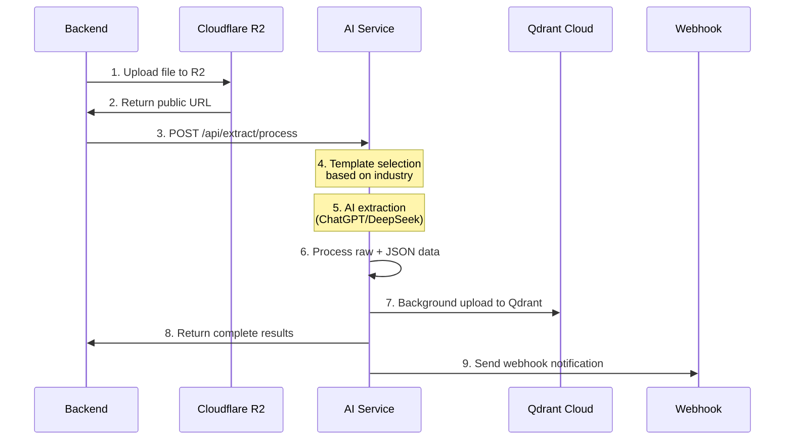

# Backend Integration Guide - AI Extraction Service
## Hướng dẫn tích hợp Backend - Dịch vụ AI Extraction

### 🎯 **OVERVIEW / TỔNG QUAN**

AI Service cung cấp **single endpoint** để Backend upload file lên R2 và xử lý extraction một cách tự động:
- ✅ Backend chỉ cần gọi **1 lần duy nhất**
- ✅ AI Service tự động extract + upload Qdrant
- ✅ Trả về cả **raw data** và **structured JSON** theo industry template
- ✅ Background processing với webhook notification

---

## 🔄 **COMPLETE WORKFLOW / LUỒNG XỬ LÝ HOÀN CHỈNH**



### **Workflow Steps:**

1. **Backend Upload**: Upload file lên R2, lấy public URL
2. **Single API Call**: Gọi `/api/extract/process` với R2 URL + metadata
3. **AI Processing**: AI Service tự động xử lý theo industry template
4. **Dual Output**: Trả về raw data + structured JSON
5. **Auto Qdrant**: Tự động upload lên Qdrant collection
6. **Webhook Notify**: Gửi notification về kết quả

---

## 📡 **API ENDPOINT DOCUMENTATION**

### **Endpoint**: `POST /api/extract/process`

**Base URL**: `https://ai.aimoney.io.vn` (Production) hoặc `http://localhost:8000` (Development)

---

## 📝 **REQUEST PAYLOAD**

```json
{
  "r2_url": "https://pub-xxx.r2.dev/files/company-123/golden_dragon_menu.pdf",
  "company_id": "golden-dragon-restaurant",
  "industry": "restaurant",
  "target_categories": ["products", "services"],
  "file_metadata": {
    "original_name": "golden_dragon_menu.pdf",
    "file_size": 1024000,
    "file_type": "application/pdf",
    "uploaded_at": "2025-07-17T10:00:00Z",
    "file_id": "file_123456"
  },
  "company_info": {
    "id": "golden-dragon-restaurant",
    "name": "Golden Dragon Restaurant",
    "industry": "restaurant",
    "description": "Traditional Vietnamese restaurant"
  },
  "language": "vi",
  "upload_to_qdrant": true,
  "callback_url": "https://api.agent8x.io.vn/api/webhooks/ai/extraction"
}
```

### **Field Descriptions:**

| Field | Type | Required | Description |
|-------|------|----------|-------------|
| `r2_url` | string | ✅ | Public R2 URL của file đã upload |
| `company_id` | string | ✅ | Company ID để lưu vào Qdrant |
| `industry` | enum | ✅ | Industry để chọn template (`restaurant`, `fashion`, `tech`, etc.) |
| `target_categories` | array | ❌ | Target extraction (`["products", "services"]`). Null = auto |
| `file_metadata` | object | ✅ | Metadata của file (name, size, type, etc.) |
| `company_info` | object | ❌ | Context thông tin company cho AI |
| `language` | enum | ❌ | Language output (`vi`, `en`). Default: `vi` |
| `upload_to_qdrant` | boolean | ❌ | Auto upload to Qdrant. Default: `false` |
| `callback_url` | string | ❌ | Webhook URL để nhận notification |

### **Supported Industries:**

```json
{
  "specialized_templates": ["restaurant", "hotel", "banking", "insurance"],
  "generic_template": [
    "fashion", "technology", "healthcare", "education", 
    "finance", "real_estate", "automotive", "travel", 
    "retail", "manufacturing", "consulting", "marketing", 
    "logistics", "entertainment", "agriculture", 
    "construction", "energy", "other"
  ]
}
```

**Note**: Industries với specialized templates sẽ có structured response rất chi tiết theo ngành. Các industries khác sử dụng generic template với flexible schema.

---

## 📤 **RESPONSE FORMAT**

### **Success Response (200 OK):**

```json
{
  "success": true,
  "message": "Auto-categorization extraction completed successfully",
  "raw_content": "GOLDEN DRAGON RESTAURANT\nMENU THỰC ĐƠN\n\n=== APPETIZERS ===\nGỏi cuốn tôm thịt - 45,000đ\nChả cá Hà Nội - 85,000đ\n...",
  "structured_data": {
    "products": [
      {
        "id": "item_001",
        "name": "Gỏi cuốn tôm thịt",
        "category": "Appetizer",
        "price": 45000,
        "currency": "VND",
        "description": "Fresh spring rolls with shrimp and pork",
        "ingredients": ["shrimp", "pork", "rice paper", "herbs"],
        "allergens": ["shellfish"],
        "available": true,
        "preparation_time": "5-10 minutes"
      }
    ],
    "services": [
      {
        "id": "service_001",
        "name": "Delivery Service",
        "category": "Food Delivery",
        "price": 20000,
        "currency": "VND",
        "description": "Free delivery for orders above 200,000đ",
        "coverage_area": "Within 5km",
        "estimated_time": "30-45 minutes"
      }
    ],
    "extraction_summary": {
      "total_products": 25,
      "total_services": 3,
      "categories_found": ["Appetizer", "Main Course", "Dessert", "Beverage"],
      "price_range": {
        "min": 25000,
        "max": 350000,
        "currency": "VND"
      }
    }
  },
  "template_used": "restaurant_template_v2",
  "ai_provider": "ChatGPT Vision",
  "industry": "restaurant",
  "data_type": "auto_categorized",
  "processing_time": 12.5,
  "total_items_extracted": 28,
  "extraction_metadata": {
    "template_version": "2.1",
    "confidence_score": 0.92,
    "extraction_method": "vision_ocr",
    "file_pages": 4,
    "text_extracted": true,
    "images_processed": 3
  }
}
```

### **Error Response (400/500):**

```json
{
  "success": false,
  "message": "Auto-categorization extraction failed",
  "processing_time": 5.2,
  "industry": "restaurant",
  "data_type": "auto_categorized",
  "error": "Failed to access R2 URL",
  "error_details": {
    "r2_url": "https://pub-xxx.r2.dev/files/invalid.pdf",
    "industry": "restaurant",
    "target_categories": ["products", "services"],
    "file_name": "invalid.pdf",
    "error_type": "HTTPError",
    "processing_time": 5.2
  }
}
```

---

## 🔧 **BACKEND IMPLEMENTATION FLOW**

### **Step 1: File Upload to R2**
```javascript
// Backend uploads file to R2 first
const r2Response = await uploadToR2(file, companyId);
const r2Url = r2Response.publicUrl;
```

### **Step 2: Call AI Extraction**
```javascript
const extractionRequest = {
  r2_url: r2Url,
  company_id: companyId,
  industry: companyInfo.industry,
  file_metadata: {
    original_name: file.originalname,
    file_size: file.size,
    file_type: file.mimetype,
    uploaded_at: new Date().toISOString(),
    file_id: fileRecord.id
  },
  company_info: {
    id: companyInfo.id,
    name: companyInfo.name,
    industry: companyInfo.industry
  },
  upload_to_qdrant: true,  // Auto upload to Qdrant
  callback_url: `${BACKEND_URL}/api/webhooks/ai/extraction`
};

const response = await fetch(`${AI_SERVICE_URL}/api/extract/process`, {
  method: 'POST',
  headers: {
    'Content-Type': 'application/json',
    'Authorization': `Bearer ${AI_SERVICE_TOKEN}`
  },
  body: JSON.stringify(extractionRequest)
});
```

### **Step 3: Handle Response**
```javascript
const result = await response.json();

if (result.success) {
  // Save extraction results to database
  await saveExtractionResults({
    fileId: fileRecord.id,
    rawContent: result.raw_content,
    structuredData: result.structured_data,
    totalItems: result.total_items_extracted,
    processingTime: result.processing_time
  });
  
  // Notify user of success
  await notifyUser(userId, 'extraction_complete', {
    totalItems: result.total_items_extracted,
    categories: result.structured_data.extraction_summary
  });
} else {
  // Handle extraction error
  await handleExtractionError(fileRecord.id, result.error);
}
```

---

## 🔔 **WEBHOOK NOTIFICATIONS**

AI Service sẽ gửi webhook notification về kết quả processing:

### **Webhook Payload:**
```json
{
  "event": "file.processed",
  "companyId": "golden-dragon-restaurant",
  "data": {
    "fileId": "file_123456",
    "status": "completed",
    "extractedItems": 28,
    "chunksCreated": 35,
    "processingTime": 12.5,
    "processedAt": "2025-07-17T10:15:30Z"
  },
  "timestamp": "2025-07-17T10:15:30Z"
}
```

### **Webhook Handler (Backend):**
```javascript
app.post('/api/webhooks/ai/extraction', (req, res) => {
  const { event, companyId, data } = req.body;
  
  if (event === 'file.processed') {
    // Update file processing status
    updateFileStatus(data.fileId, data.status);
    
    // Notify user if completed
    if (data.status === 'completed') {
      notifyUser(companyId, 'extraction_ready', {
        fileId: data.fileId,
        itemsExtracted: data.extractedItems
      });
    }
  }
  
  res.status(200).json({ received: true });
});
```

---

## 🏭 **INDUSTRY-SPECIFIC TEMPLATES**

AI Service hỗ trợ 5 specialized templates và 1 generic template:

### **✅ Specialized Templates (5):**

#### **🍽️ Restaurant Template:**
- **Products**: Menu items, dishes, beverages, specials
- **Services**: Delivery, catering, private dining, reservations
- **Specific Fields**: 
  - `cuisine_type`: vietnamese, chinese, japanese, korean, thai, western, fusion
  - `spice_level`: none, mild, medium, hot, extra_hot
  - `dietary_options`: vegetarian, vegan, gluten_free, halal, kosher
  - `preparation_time`: minutes, portion_size, main_ingredients
  - `pricing`: Supports Vietnamese notation (450K = 450,000 VND)

**Example Product Response:**
```json
{
  "name": "Phở bò tái",
  "name_en": "Rare Beef Pho",
  "description": "Phở bò với thịt bò tái, bánh phở tươi",
  "category": "main_course",
  "sub_category": "pho",
  "price": 85000,
  "currency": "VND",
  "industry_data": {
    "dish_details": {
      "cuisine_type": "vietnamese",
      "spice_level": "mild",
      "main_ingredients": ["beef", "rice_noodles", "herbs"],
      "preparation_time": 15
    },
    "dietary_options": {
      "gluten_free": true,
      "halal": false
    }
  }
}
```

#### **🏨 Hotel Template:**
- **Products**: Room types, dining venues, packages, spa services
- **Services**: Concierge, transportation, business services, recreation
- **Specific Fields**:
  - `room_specifications`: size_sqm, bed_configuration, max_occupancy, view_type, floor_range
  - `room_amenities`: Phân loại chi tiết theo comfort, entertainment, connectivity, bathroom
  - `dining_info`: venue_name, cuisine_types, meal_periods, service_style, seating_capacity
  - `pricing_structure`: base_rate, extra_adult, extra_child, peak_season_surcharge
  - `policies`: check_in_time, check_out_time, cancellation_policy, children_policy

**Detailed Room Amenities Structure:**
```json
{
  "room_amenities": {
    "comfort": {
      "air_conditioning": true,
      "minibar": true,
      "coffee_machine": true,
      "safe": true
    },
    "entertainment": {
      "smart_tv": true,
      "tv_size": "55 inch",
      "sound_system": false
    },
    "connectivity": {
      "wifi": true,
      "ethernet": false,
      "usb_charging": true
    },
    "bathroom": {
      "bathtub": true,
      "rain_shower": true,
      "hairdryer": true,
      "toiletries": true
    }
  }
}
```

**Example Product Response:**
```json
{
  "name": "Deluxe Ocean View Suite",
  "category": "accommodation",
  "sub_category": "suite",
  "price": 4500000,
  "currency": "VND",
  "price_unit": "per_night",
  "industry_data": {
    "room_specifications": {
      "room_type": "suite",
      "size_sqm": 65,
      "bed_configuration": "king",
      "max_occupancy": {"adults": 3, "children": 2},
      "view_type": "sea_view",
      "floor_range": "15-20",
      "bathroom_type": "jacuzzi"
    },
    "room_amenities": {
      "comfort": {"air_conditioning": true, "minibar": true, "safe": true},
      "entertainment": {"smart_tv": true, "tv_size": "65 inch"},
      "connectivity": {"wifi": true, "usb_charging": true},
      "bathroom": {"bathtub": true, "rain_shower": true, "jacuzzi": true}
    },
    "pricing_structure": {
      "base_rate": 4500000,
      "extra_adult": 800000,
      "extra_child": 400000,
      "weekend_surcharge": 900000
    },
    "policies": {
      "check_in_time": "15:00",
      "check_out_time": "12:00",
      "cancellation_policy": "Free cancellation 24h before",
      "deposit_required": true
    }
  }
}
```

#### **🏦 Banking Template:**
- **Products**: Savings accounts, credit cards, loans, investments
- **Services**: Wealth management, advisory, remittance, corporate banking
- **Specific Fields**:
  - `account_type`: savings, checking, term_deposit, investment
  - `interest_rates`: annual_rate, promotional_rate, compound_frequency
  - `eligibility`: minimum_age, income_requirement, credit_score
  - `fees`: monthly_fee, annual_fee, transaction_fee, penalty_fee
  - `terms`: minimum_balance, lock_period, early_withdrawal

**Example Product Response:**
```json
{
  "name": "Tài khoản tiết kiệm VIP",
  "name_en": "VIP Savings Account",
  "category": "savings",
  "sub_category": "premium",
  "price": 5000000,
  "currency": "VND",
  "price_unit": "minimum_balance",
  "industry_data": {
    "account_details": {
      "account_type": "savings",
      "interest_rate_annual": 6.5,
      "compound_frequency": "monthly",
      "minimum_balance": 5000000
    },
    "fees": {
      "monthly_maintenance": 0,
      "below_minimum_fee": 50000,
      "withdrawal_fee": 0
    },
    "eligibility": {
      "minimum_age": 18,
      "income_requirement": 15000000,
      "required_documents": ["id", "income_proof"]
    }
  }
}
```

#### **🛡️ Insurance Template (Multi-Country Support):**
- **Products**: Life, health, auto, property, travel insurance policies
- **Services**: Claims processing, underwriting, advisory, customer support
- **Multi-Country Support**: Vietnam (VND) và USA (USD) markets
- **Specific Fields**:
  - `policy_details`: country, state_province, policy_type, coverage_amount, policy_term
  - `coverage_benefits`: inpatient, outpatient, emergency, prescriptions, dental, vision, maternity
  - `coverage_limits`: annual_limit, deductible_amount, copay_percentage, out_of_pocket_maximum
  - `network_providers`: hospital_count, international_coverage, emergency_evacuation
  - `policy_conditions`: waiting_period, pre_existing_conditions, age_restrictions, medical_exam
  - `premiums_structure`: age_based, gender_based, occupation_loading, family_discounts

**Country-Specific Features:**
- **Vietnam (VND)**: Local hospitals, Vietnamese regulations, VND pricing
- **USA (USD)**: State-specific regulations, US healthcare network, USD pricing
- **Auto-Detection**: Based on currency, keywords, or explicit country field

**Detailed Coverage Structure:**
```json
{
  "coverage_benefits": {
    "inpatient_treatment": true,
    "outpatient_treatment": true,
    "emergency_care": true,
    "prescription_drugs": true,
    "dental_coverage": false,
    "vision_coverage": false,
    "maternity_coverage": true,
    "mental_health": true,
    "rehabilitation": true
  },
  "coverage_limits": {
    "annual_limit": 500000000,
    "per_incident_limit": 100000000,
    "deductible_amount": 2000000,
    "copay_percentage": 20,
    "out_of_pocket_maximum": 50000000
  },
  "network_providers": {
    "hospital_count": 250,
    "clinic_count": 1500,
    "international_coverage": true,
    "emergency_evacuation": true
  }
}
```

**Example Vietnam Product Response:**
```json
{
  "name": "Bảo hiểm sức khỏe gia đình cao cấp",
  "name_en": "Premium Family Health Insurance",
  "category": "health_insurance",
  "sub_category": "family_plan",
  "price": 18000000,
  "currency": "VND",
  "price_unit": "annual_premium",
  "industry_data": {
    "policy_details": {
      "country": "vietnam",
      "policy_type": "family",
      "coverage_amount": 1000000000,
      "policy_term": "1_year",
      "renewable": true
    },
    "coverage_benefits": {
      "inpatient_treatment": true,
      "emergency_care": true,
      "prescription_drugs": true,
      "maternity_coverage": true
    },
    "coverage_limits": {
      "annual_limit": 1000000000,
      "deductible_amount": 3000000,
      "copay_percentage": 15
    },
    "policy_conditions": {
      "waiting_period_days": 30,
      "pre_existing_conditions": "limited",
      "age_restrictions": {
        "min_age": 0,
        "max_age": 70,
        "renewal_age_limit": 75
      }
    },
    "premiums_structure": {
      "family_discounts": {
        "spouse_discount": 10,
        "children_discount": 20
      }
    }
  }
}
```

**Example USA Product Response:**
```json
{
  "name": "Comprehensive Health Plan",
  "category": "health_insurance",
  "sub_category": "individual_plan",
  "price": 4800,
  "currency": "USD",
  "price_unit": "annual_premium",
  "industry_data": {
    "policy_details": {
      "country": "usa",
      "state_province": "california",
      "policy_type": "individual",
      "coverage_amount": 2000000,
      "policy_term": "1_year"
    },
    "coverage_limits": {
      "annual_limit": 2000000,
      "deductible_amount": 1500,
      "copay_percentage": 20,
      "out_of_pocket_maximum": 8000
    },
    "network_providers": {
      "hospital_count": 500,
      "clinic_count": 3000,
      "international_coverage": false
    }
  }
}
```

#### **🏢 Generic Template (Default):**
- **Used for**: Fashion, Technology, Healthcare, Education, Manufacturing, Retail, và tất cả industries khác
- **Products**: General products with flexible schema
- **Services**: General services with basic categorization
- **Fields**: Standard fields như name, category, price, description với flexible `specifications` object

**Example Generic Product Response:**
```json
{
  "name": "iPhone 15 Pro",
  "category": "electronics",
  "sub_category": "smartphone",
  "price": 29990000,
  "currency": "VND",
  "brand": "Apple",
  "model": "iPhone 15 Pro",
  "specifications": {
    "screen_size": "6.1 inch",
    "storage": "128GB",
    "color": "Natural Titanium",
    "os": "iOS 17"
  },
  "features": ["Face ID", "A17 Pro chip", "Pro Camera system"],
  "availability": "available"
}
```

### **📋 Template Selection Logic:**

1. **Explicit Industry**: Khi `industry` field được set trong request
2. **Auto-Detection**: AI Service phân tích content để detect industry
3. **Fallback**: Sử dụng Generic template nếu không detect được

**Priority Industries với Specialized Templates:**
```json
{
  "specialized": ["restaurant", "hotel", "banking", "insurance"],
  "generic_fallback": ["fashion", "technology", "healthcare", "education", 
                       "retail", "manufacturing", "consulting", "logistics", 
                       "automotive", "real_estate", "other"]
}
```

---

## ⚡ **PERFORMANCE & LIMITS**

### **Processing Times:**
- **Small files** (< 1MB): 3-8 seconds
- **Medium files** (1-10MB): 8-20 seconds  
- **Large files** (10-50MB): 20-60 seconds

### **File Size Limits:**
- **Maximum file size**: 50MB
- **Supported formats**: PDF, PNG, JPG, JPEG, DOCX, TXT

### **Rate Limits:**
- **Per company**: 100 requests/hour
- **Per endpoint**: 1000 requests/hour
- **Concurrent requests**: 10 per company

---

## 🔐 **AUTHENTICATION**

### **API Key Authentication:**
```http
POST /api/extract/process
X-API-Key: agent8x-backend-secret-key-2025
Content-Type: application/json
```

### **Request từ Backend:**
```javascript
const headers = {
  'X-API-Key': process.env.AI_SERVICE_API_KEY,
  'Content-Type': 'application/json'
};
```

---

## 📊 **MONITORING & HEALTH CHECKS**

### **Health Check Endpoint:**
```http
GET /api/extract/health
```

**Response:**
```json
{
  "service": "AI Extraction Service",
  "status": "healthy",
  "timestamp": "2025-07-17T10:00:00Z",
  "ai_providers": {
    "chatgpt": true,
    "deepseek": true,
    "gemini": true
  },
  "template_system": {
    "status": "ready",
    "available_templates": 6,
    "specialized_templates": ["restaurant", "hotel", "banking", "insurance"],
    "generic_template": "covers all other industries"
  },
  "supported_file_types": ["pdf", "png", "jpg", "jpeg", "docx", "txt"]
}
```

### **Service Info Endpoint:**
```http
GET /api/extract/info
```

---

## 🚨 **ERROR HANDLING**

### **Common Error Codes:**

| Status | Error Type | Description | Solution |
|--------|------------|-------------|----------|
| 400 | `invalid_r2_url` | R2 URL không accessible | Check R2 permissions |
| 400 | `unsupported_file_type` | File type không support | Use PDF/PNG/JPG |
| 400 | `file_too_large` | File > 50MB | Reduce file size |
| 401 | `unauthorized` | API key invalid | Check authentication |
| 429 | `rate_limit_exceeded` | Quá rate limit | Wait và retry |
| 500 | `ai_provider_error` | AI service lỗi | Retry sau vài phút |
| 500 | `qdrant_upload_error` | Qdrant upload failed | Check Qdrant status |

### **Error Response Example:**
```json
{
  "success": false,
  "message": "File type not supported",
  "error": "unsupported_file_type",
  "error_details": {
    "file_type": "xlsx",
    "supported_types": ["pdf", "png", "jpg", "jpeg", "docx", "txt"],
    "suggestion": "Convert to PDF format"
  }
}
```

---

## 🔧 **TESTING**

### **Test với cURL:**
```bash
curl -X POST "http://localhost:8000/api/extract/process" \
  -H "Content-Type: application/json" \
  -H "X-API-Key: agent8x-backend-secret-key-2025" \
  -d '{
    "r2_url": "https://pub-xxx.r2.dev/test-menu.pdf",
    "company_id": "test-company",
    "industry": "restaurant",
    "file_metadata": {
      "original_name": "test-menu.pdf",
      "file_size": 1024000,
      "file_type": "application/pdf",
      "uploaded_at": "2025-07-17T10:00:00Z"
    },
    "upload_to_qdrant": true
  }'
```

### **Expected Success Response:**
- ✅ `success: true`
- ✅ Raw content extracted
- ✅ Structured JSON data
- ✅ Background Qdrant upload
- ✅ Processing time < 30s

---

## 📚 **INTEGRATION EXAMPLES**

### **Node.js/Express Integration:**
```javascript
// services/aiExtractionService.js
class AIExtractionService {
  constructor(apiKey, baseUrl) {
    this.apiKey = apiKey;
    this.baseUrl = baseUrl;
  }

  async extractFromR2(r2Url, companyId, industry, fileMetadata) {
    const response = await fetch(`${this.baseUrl}/api/extract/process`, {
      method: 'POST',
      headers: {
        'Authorization': `Bearer ${this.apiKey}`,
        'Content-Type': 'application/json'
      },
      body: JSON.stringify({
        r2_url: r2Url,
        company_id: companyId,
        industry: industry,
        file_metadata: fileMetadata,
        upload_to_qdrant: true,
        callback_url: `${process.env.BACKEND_URL}/api/webhooks/ai/extraction`
      })
    });

    return await response.json();
  }
}
```

### **Python/FastAPI Integration:**
```python
import httpx
import asyncio

class AIExtractionService:
    def __init__(self, api_key: str, base_url: str):
        self.api_key = api_key
        self.base_url = base_url
        self.client = httpx.AsyncClient()

    async def extract_from_r2(self, r2_url: str, company_id: str, 
                             industry: str, file_metadata: dict):
        response = await self.client.post(
            f"{self.base_url}/api/extract/process",
            headers={
                "Authorization": f"Bearer {self.api_key}",
                "Content-Type": "application/json"
            },
            json={
                "r2_url": r2_url,
                "company_id": company_id,
                "industry": industry,
                "file_metadata": file_metadata,
                "upload_to_qdrant": True,
                "callback_url": f"{BACKEND_URL}/api/webhooks/ai/extraction"
            }
        )
        return response.json()
```

---

## 📋 **CHECKLIST CHO BACKEND TEAM**

### **Pre-Integration:**
- [ ] Có AI Service API key
- [ ] R2 bucket đã setup với public access
- [ ] Webhook endpoint đã implement
- [ ] Database schema cho extraction results

### **Integration Steps:**
- [ ] Implement file upload to R2  
- [ ] Call AI extraction endpoint
- [ ] Handle success/error responses
- [ ] Save extraction results to database
- [ ] Setup webhook handler
- [ ] Add error handling & retries

### **Testing:**
- [ ] Test với file PDF restaurant menu
- [ ] Test với file ảnh fashion products  
- [ ] Test error cases (invalid URL, large files)
- [ ] Test webhook notifications
- [ ] Test rate limiting

### **Production:**
- [ ] Monitor API response times
- [ ] Setup logging cho extraction requests
- [ ] Alert system cho failed extractions
- [ ] Regular health checks

---

## 🎯 **SUMMARY**

**Single API Call Solution:**
1. Backend upload file → R2 → get public URL
2. Call `/api/extract/process` với R2 URL + metadata  
3. AI Service tự động extract + upload Qdrant
4. Nhận về raw data + structured JSON + processing status
5. Background webhook notification khi hoàn thành

**Key Benefits:**
- ✅ **One-time call**: Backend chỉ gọi 1 lần
- ✅ **Auto processing**: AI Service tự handle everything
- ✅ **Dual output**: Raw + JSON structured data
- ✅ **Auto Qdrant**: Tự động upload vào vector database
- ✅ **Industry-specific**: Templates theo từng ngành nghề
- ✅ **Webhook notify**: Real-time status updates

Ready cho production integration! 🚀
