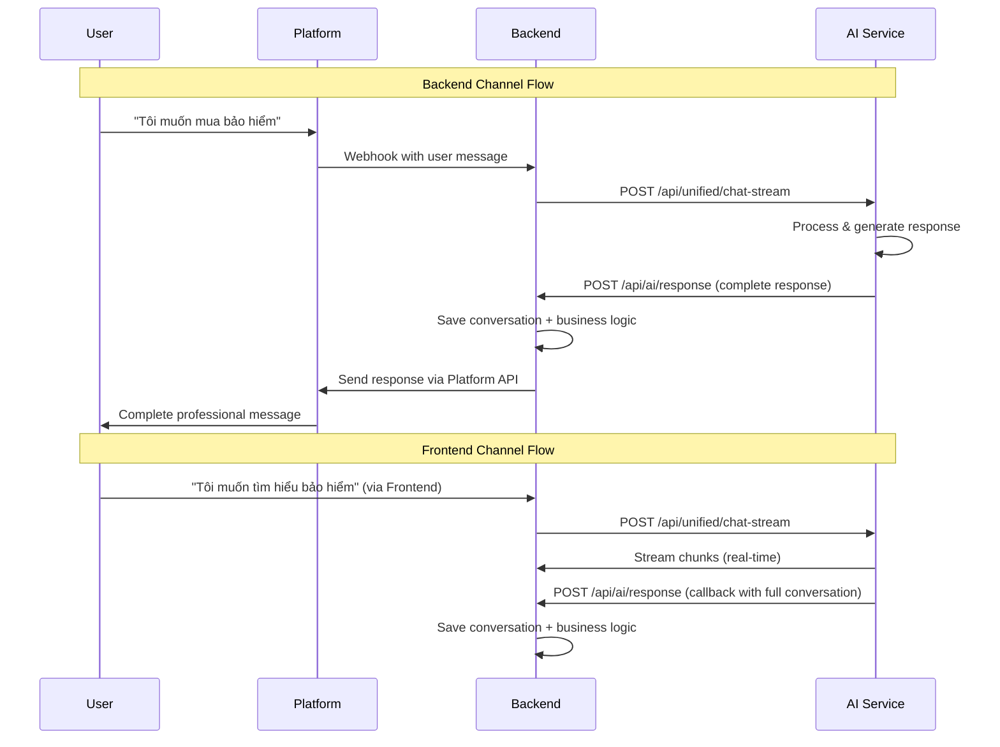

# 🧪 Channel Routing Test Documentation

## 📋 **Implementation Complete!**

AI Service đã được implement với logic channel routing để phân biệt response destination:

### ✅ **New Features Implemented**:

1. **ChannelType Enum**: 6 channels (5 backend + 1 frontend)
2. **LeadSourceInfo Model**: Marketing attribution tracking
3. **Channel Validation**: Request validation theo channel requirements
4. **Response Routing Logic**: AI Service check channel và route correctly
5. **Backend Communication**: HTTP POST to backend for non-chatdemo channels

---

## 🎯 **Testing Examples**

### **1. Frontend Channel (chatdemo)**
```bash
curl -X POST https://ai.aimoney.io.vn/api/unified/chat-stream \
  -H "Content-Type: application/json" \
  -d '{
    "message": "Tôi muốn tìm hiểu về bảo hiểm",
    "company_id": "aia-insurance",
    "industry": "insurance",
    "session_id": "frontend_user_123",
    "user_info": {
      "user_id": "frontend_user_123",
      "device_id": "web_browser_456",
      "source": "web_device",
      "name": "Nguyen Van A"
    },
    "channel": "chatdemo",
    "language": "VIETNAMESE"
  }'
```

**Expected Response**: ✅ Stream chunks trực tiếp về frontend
**Note**: ✅ `message_id` tự động generate cho frontend requests

### **2. Backend Channel (messenger)**
```bash
curl -X POST https://ai.aimoney.io.vn/api/unified/chat-stream \
  -H "Content-Type: application/json" \
  -d '{
    "message": "Tôi muốn mua bảo hiểm",
    "message_id": "msg_backend_messenger_12345",
    "company_id": "aia-insurance",
    "industry": "insurance",
    "session_id": "messenger_USER_PSID_1691234567890",
    "user_info": {
      "user_id": "FACEBOOK_USER_PSID",
      "device_id": "messenger_USER_PSID",
      "source": "facebook_messenger",
      "name": "User Full Name",
      "email": null,
      "phone": null
    },
    "lead_source": {
      "id": "lead-source-uuid",
      "name": "Facebook Messenger",
      "sourceCode": "FB_MESSENGER",
      "category": "social_media"
    },
    "channel": "messenger",
    "language": "VIETNAMESE"
  }'
```

**Expected Response**: ✅ `{"type": "backend_processed", "channel": "messenger", "success": true}`
**Note**: ✅ Backend phải provide `message_id` trong request

### **3. Backend Channel (chat-plugin)**
```bash
curl -X POST https://ai.aimoney.io.vn/api/unified/chat-stream \
  -H "Content-Type: application/json" \
  -d '{
    "message": "Cho tao thông tin phòng của khách sạn giá xem",
    "message_id": "msg_chat-plugin_ws_mermaidseaside_plugin_d_1754765336971_1754767103277",
    "company_id": "1e789800-b402-41b0-99d6-2e8d494a3beb",
    "industry": "hotel",
    "session_id": "chat-plugin_ws_mermaidseaside_plugin_d_1754765336971_1754767103320",
    "user_info": {
      "user_id": "ws_mermaidseaside_plugin_d_1754765336971",
      "device_id": "web_ws_mermaidseaside_plugin_d_1754765336971",
      "source": "chat_plugin",
      "name": "Anonymous",
      "email": null,
      "phone": null
    },
    "lead_source": {
      "id": "0521abd4-abe0-4cbc-92af-4d34939444ae",
      "name": "Website Chat Plugin",
      "sourceCode": "CHAT_PLUGIN",
      "category": "website"
    },
    "channel": "chat-plugin",
    "language": "VIETNAMESE"
  }'
```

**Expected Response**: ✅ `{"type": "backend_processed", "channel": "chat-plugin", "success": true}`
**Note**: ✅ Backend phải provide `message_id` trong request và `source: "chat_plugin"`

### **4. Backend Channel (whatsapp)**
```bash
curl -X POST https://ai.aimoney.io.vn/api/unified/chat-stream \
  -H "Content-Type: application/json" \
  -d '{
    "message": "Lãi suất vay thế chấp bao nhiêu?",
    "message_id": "msg_backend_whatsapp_67890",
    "company_id": "vietcombank",
    "industry": "banking",
    "session_id": "whatsapp_+84987654321_1691234567890",
    "user_info": {
      "user_id": "+84987654321",
      "device_id": "whatsapp_+84987654321",
      "source": "whatsapp",
      "name": "Nguyen Van B",
      "phone": "+84987654321"
    },
    "lead_source": {
      "id": "whatsapp-lead-source",
      "name": "WhatsApp Business",
      "sourceCode": "WHATSAPP_BUSINESS",
      "category": "messaging"
    },
    "channel": "whatsapp",
    "language": "VIETNAMESE"
  }'
```

**Expected Response**: ✅ `{"type": "backend_processed", "channel": "whatsapp", "success": true}`
**Note**: ✅ Backend phải provide `message_id` trong request

---

## 🔧 **Channel Routing Logic Summary**

### **Frontend Channels (Stream + Callback)**:
```
User → Frontend/Plugin → AI Service → Frontend/Plugin (Stream chunks) + Backend (Callback)
```

### **Backend Channels (Direct Response)**:
```
User → Platform → Backend → AI Service → Backend (Full response) → Platform API → User
```

### **Channel Mapping**:
- **`chatdemo`** → ✅ Stream to Frontend + Callback to Backend
- **`chat-plugin`** → ✅ Stream to Plugin + Callback to Backend
- **`messenger`** → ✅ Send to Backend → Facebook Messenger API
- **`instagram`** → ✅ Send to Backend → Instagram Business API
- **`whatsapp`** → ✅ Send to Backend → WhatsApp Business API
- **`zalo`** → ✅ Send to Backend → Zalo API

---

## 📊 **Response Headers**

AI Service sẽ include channel info trong response headers:

```
X-Channel-Type: chatdemo
X-Channel-Type: messenger
X-Channel-Type: whatsapp
# etc.
```

---

## 🔍 **Validation Rules**

### **Frontend Channels (chatdemo, chat-plugin)**:
- ✅ No special requirements
- ✅ Works with anonymous users
- ✅ `message_id` tự động generate nếu không có
- ✅ Stream response directly to caller
- ✅ Send callback to backend for history/analytics

### **Backend Channels (messenger, instagram, whatsapp, zalo)**:
- ✅ `user_info.user_id` (required)
- ⚠️ `lead_source` (warning if missing)
- ✅ `message_id` should be provided by backend
- ✅ Full response sent to backend for platform processing

---

## 🆔 **Message ID Handling**

### **📱 Frontend Requests (chatdemo)**:
- **Optional**: Frontend không cần gửi `message_id`
- **Auto-generated**: AI Service tự động tạo `message_id` nếu không có
- **Format**: `msg_{timestamp}_{uuid8chars}`
- **Example**: `msg_1691234567_a1b2c3d4`

```javascript
// Frontend request - NO message_id needed
{
  "message": "Hello",
  "company_id": "test",
  "channel": "chatdemo"
  // message_id will be auto-generated
}
```

### **🔧 Backend Requests (messenger, whatsapp, etc.)**:
- **Recommended**: Backend nên provide `message_id`
- **Context Tracking**: Giúp track message lifecycle từ platform → backend → AI service → response
- **Format**: `msg_backend_{platform}_{unique_id}`
- **Example**: `msg_backend_messenger_FB_12345`

```javascript
// Backend request - message_id recommended
{
  "message": "Tôi muốn mua bảo hiểm",
  "message_id": "msg_backend_messenger_FB_12345",
  "company_id": "aia-insurance",
  "channel": "messenger"
}
```

### **🔄 Message ID Flow**:

**Frontend Flow**:
```
Frontend → AI Service (no message_id) → Auto-generate → Process → Response with message_id
```

**Backend Flow**:
```
Platform → Backend (with platform message_id) → AI Service (with message_id) → Response with same message_id
```

---

## 🔗 **Channel to Source Mapping - AUTO-UNIFIED**

**🎯 QUAN TRỌNG**: AI Service bây giờ **TỰ ĐỘNG** map `channel` → `user_info.source`, Backend **KHÔNG CẦN** quan tâm `user_info.source` nữa!

### **✅ Backend chỉ cần gửi đúng `channel`**:

| Channel | Auto-mapped user_info.source | Platform |
|---------|------------------------------|----------|
| `"messenger"` | ✅ `"facebook_messenger"` | Facebook Messenger |
| `"instagram"` | ✅ `"instagram"` | Instagram Direct |
| `"whatsapp"` | ✅ `"whatsapp"` | WhatsApp Business |
| `"zalo"` | ✅ `"zalo"` | Zalo Official Account |
| `"chat-plugin"` | ✅ `"chat_plugin"` | Website Chat Widget |
| `"chatdemo"` | ✅ `"web_device"` | Frontend Demo |

### **🔄 Processing Logic**:
```javascript
// Backend request
{
  "channel": "chat-plugin",
  "user_info": {
    "source": "whatever"  // ❌ Will be IGNORED and auto-set to "chat_plugin"
  }
}

// AI Service auto-processing
request.user_info.source = auto_map_from_channel(request.channel)
// Result: source = "chat_plugin"
```

### **� Backward Compatibility**:
- ✅ **Legacy webhooks**: Vẫn hoạt động nếu chỉ có `user_info.source` (không có `channel`)
- ✅ **New requests**: Chỉ cần `channel`, `user_info.source` sẽ được tự động set
- ✅ **Mixed requests**: `channel` override `user_info.source`

### **❌ Common Mistakes (KHÔNG CẦN QUAN TÂM NỮA)**:
```javascript
// OLD WAY - Backend phải careful mapping
{
  "channel": "chat-plugin",
  "user_info": {
    "source": "website"  // ❌ Sai! Phải là "chat_plugin"
  }
}

// NEW WAY - Backend chỉ cần channel
{
  "channel": "chat-plugin",
  "user_info": {
    "user_id": "ws_user_123",
    "name": "Anonymous"
    // source will be auto-set to "chat_plugin"
  }
}
```

---

## 🧪 **Next Steps for Backend Integration**

1. **Backend Endpoint**: Implement `/api/ai/response` to receive AI responses
2. **Platform APIs**: Connect to Meta, Zalo, WebSocket services
3. **Error Handling**: Handle AI Service communication failures
4. **Queue System**: Optional Redis queue for reliability
5. **Monitoring**: Log channel routing metrics

---

## 🤔 **Tại Sao Frontend Stream Chunks Còn Backend Full Response?**

### **1. 📱 Frontend Channel (`chatdemo`) - Stream Chunks Trực Tiếp**

#### **Lý do Stream Chunks**:
```
User types → Frontend → AI Service → Stream chunks → Frontend displays real-time
```

- **Real-time Experience**: User thấy response từng từ một, giống ChatGPT
- **Direct Connection**: Frontend gọi trực tiếp AI Service, không cần middleware
- **Interactive UI**: Có thể show typing indicator, progress, cancel request
- **Low Latency**: Không có layer trung gian, response nhanh nhất

#### **Technical Implementation**:
```javascript
// Frontend nhận stream chunks
const response = await fetch('/api/unified/chat-stream', {
    method: 'POST',
    body: JSON.stringify({
        channel: "chatdemo",
        message: "Hello"
    })
});

// Process each chunk as it arrives
const reader = response.body.getReader();
while (true) {
    const {done, value} = await reader.read();
    if (done) break;

    // Display chunk immediately
    displayChunk(new TextDecoder().decode(value));
}
```

### **2. 🔄 Backend Channels - Full Response qua `/api/ai/response`**

#### **Lý do Cần Full Response**:
```
User → Platform → Backend → AI Service → Full Response → Backend → Platform API → User
```

#### **A. Platform API Limitations**:

**Facebook Messenger API**:
```javascript
// Messenger chỉ accept complete message
POST https://graph.facebook.com/v18.0/me/messages
{
  "recipient": {"id": "USER_PSID"},
  "message": {"text": "Complete AI response here"}  // ❌ Không thể gửi chunks
}
```

**WhatsApp Business API**:
```javascript
// WhatsApp cũng cần complete message
POST https://graph.facebook.com/v20.0/PHONE_NUMBER_ID/messages
{
  "to": "PHONE_NUMBER",
  "text": {"body": "Full response only"}  // ❌ Không support streaming
}
```

#### **B. Technical Constraints**:

1. **Platform API Design**:
   - Meta APIs, Zalo APIs không support streaming messages
   - Chỉ accept single complete message per API call
   - Gửi nhiều chunks = spam user với nhiều messages riêng biệt

2. **User Experience on Platforms**:
   ```
   ❌ Bad: Streaming chunks
   User: "Lãi suất vay bao nhiêu?"
   Bot: "Chào"
   Bot: " bạn!"
   Bot: " Lãi"
   Bot: " suất"
   Bot: " vay"
   Bot: " hiện"
   Bot: " tại..."

   ✅ Good: Complete response
   User: "Lãi suất vay bao nhiêu?"
   Bot: "Chào bạn! Lãi suất vay hiện tại dao động từ 6.5%-12%/năm..."
   ```

3. **Backend Processing Logic**:
   ```javascript
   // Backend cần xử lý sau khi có full response
   async function handleAIResponse(fullResponse) {
       // 1. Log full conversation
       await logConversation(userMessage, fullResponse);

       // 2. Extract intent & entities
       const intent = extractIntent(fullResponse);
       const entities = extractEntities(fullResponse);

       // 3. Send to platform
       await sendToPlatform(fullResponse);
       // 4. Update CRM/Lead scoring
       await updateLeadScore(userId, intent, entities);

       // 5. Trigger follow-up workflows
       await triggerWorkflows(intent, entities);
   }
   ```

#### **C. Separate Endpoint Logic `/api/ai/response`**:

**Tại sao không dùng chung endpoint?**

1. **Request Direction**:
   ```
   Frontend → AI Service: Frontend initiates request
   AI Service → Backend: AI Service initiates callback
   ```

2. **Different Payloads**:
   ```javascript
   // Frontend request
   POST /api/unified/chat-stream
   {
       "message": "user input",
       "channel": "chatdemo"
   }

   // AI Service → Backend callback
   POST /api/ai/response
   {
       "channel": "messenger",
       "ai_response": "complete response",
       "original_request": {...},
       "processing_complete": true
   }
   ```

3. **Authentication & Security**:
   ```javascript
   // Frontend endpoint: User authentication
   headers: {
       "Authorization": "Bearer user_token"
   }

   // Backend endpoint: Service-to-service auth
   headers: {
       "X-AI-Service": "true",
       "X-API-Token": "service_token"
   }
   ```

### **3. 🔧 Why This Architecture?**

#### **Separation of Concerns**:
```
┌─────────────┐    ┌─────────────┐    ┌─────────────┐
│  Frontend   │    │ AI Service  │    │  Backend    │
│             │    │             │    │             │
│ • Real-time │◄──►│ • Channel   │◄──►│ • Platform  │
│ • Interactive│    │   Detection │    │   APIs      │
│ • Streaming │    │ • Response  │    │ • Business  │
│             │    │   Routing   │    │   Logic     │
└─────────────┘    └─────────────┘    └─────────────┘
```

#### **Benefits**:
1. **Frontend**: Optimal user experience với real-time streaming
2. **Backend**: Platform integration với complete responses
3. **AI Service**: Single service, multiple routing destinations
4. **Scalability**: Mỗi component optimize cho use case riêng

#### **Real-World Example**:

**Scenario A: Frontend Channel (chatdemo)**
```
1. User → Frontend → AI Service: "Lãi suất vay?"
2. AI Service → Frontend: Stream chunks (real-time)
3. AI Service → Backend: POST /api/ai/response (callback with full conversation)
   {
     "channel": "chatdemo",
     "user_message": "Lãi suất vay?",
     "ai_response": "Lãi suất vay hiện tại dao động...",
     "conversation_id": "frontend_session_123"
   }
4. Backend: Save conversation history + business logic
```

**Scenario B: Backend Channel (messenger)**
```
1. User → Messenger → Backend webhook: "Lãi suất vay?"
2. Backend → AI Service: POST /api/unified/chat-stream
   {"channel": "messenger", "message": "Lãi suất vay?"}
3. AI Service returns: Complete response directly to Backend
4. Backend: Save conversation + business logic (no callback needed!)
5. Backend → Messenger API: Send complete response
6. Messenger → User: Professional message
```

### **4. 📊 Performance Comparison**

| Aspect | Frontend (Stream) | Backend (Full) |
|--------|------------------|----------------|
| **Latency** | First chunk: ~200ms | Complete: ~2-3s |
| **UX** | Real-time typing | Single professional message |
| **Platform Support** | Web only | All messaging platforms |
| **Processing** | Client-side display | Server-side business logic |
| **Reliability** | Direct connection | Async with retry logic |

---

## 💡 **Summary**

### **Frontend Channel (chatdemo)**:
- **Stream chunks** to Frontend for real-time UX
- **Callback to Backend** để save conversation history
- Frontend chỉ display, Backend handle business logic

### **Backend Channels (messenger, whatsapp, zalo, etc.)**:
- **Direct complete response** to Backend
- **No callback needed** - Backend đã có full conversation
- Backend save history + send to platform APIs

**AI Service thông minh detect channel và route accordingly!** 🚀

### **Key Insight**:
- **Frontend** = Stream + Callback (vì Frontend không save data)
- **Backend** = Direct Response (vì Backend đã initiate và có full context)

---

## 🎉 **Implementation Status**

✅ **COMPLETED**:
- ChannelType enum với 6 channels
- LeadSourceInfo model cho marketing attribution
- UnifiedChatRequest updated với channel và lead_source
- Channel validation logic
- Response routing trong stream_response_optimized
- Backend communication method
- Environment variables cho backend integration
- Test documentation

🚀 **AI Service bây giờ đã support đầy đủ channel routing!**

---

## 📋 **Backend Endpoint Technical Documentation**

### **🎯 Endpoint: `POST /api/ai/response`**

Backend service phải implement endpoint này để nhận AI responses từ AI Service cho các backend channels.

#### **📨 Request Headers**

AI Service sẽ gửi request với headers sau:

```javascript
{
  "Content-Type": "application/json",
  "X-Webhook-Source": "ai-service",
  "X-Webhook-Secret": "webhook-secret-for-signature",
  "User-Agent": "Agent8x-AI-Service/1.0"
}
```

**Environment Variable trong AI Service**:
```bash
WEBHOOK_SECRET=webhook-secret-for-signature
```

#### **📦 Request Body Schema**

**Frontend Channel Callback (chatdemo)**:
```json
{
  "event": "ai.response.completed",
  "channel": "chatdemo",
  "timestamp": "2025-08-09T10:30:00.000Z",
  "company_id": "aia-insurance",
  "session_id": "frontend_user_123",
  "conversation": {
    "user_message": "Tôi muốn tìm hiểu về bảo hiểm",
    "ai_response": "Chào bạn! AIA cung cấp nhiều sản phẩm bảo hiểm...",
    "message_id": "msg_12345",
    "processing_time_ms": 2500,
    "thinking": {
      "analysis": "User đang tìm hiểu thông tin về bảo hiểm, cần cung cấp overview về các sản phẩm",
      "confidence": 0.9,
      "detected_keywords": ["bảo hiểm", "tìm hiểu"]
    },
    "intent": "information"
  },
  "user_info": {
    "user_id": "frontend_user_123",
    "device_id": "web_browser_456",
    "source": "web_device",
    "name": "Nguyen Van A"
  },
  "metadata": {
    "industry": "insurance",
    "language": "VIETNAMESE",
    "ai_provider": "openai",
    "model": "gpt-4o-mini",
    "token_usage": {
      "prompt_tokens": 150,
      "completion_tokens": 200,
      "total_tokens": 350
    }
  }
}
```

**Backend Channel Response (messenger, whatsapp, etc.)**:
```json
{
  "event": "ai.response.ready",
  "channel": "messenger",
  "timestamp": "2025-08-09T10:30:00.000Z",
  "company_id": "aia-insurance",
  "session_id": "messenger_USER_PSID_1691234567890",
  "response": {
    "message": "Chào bạn! AIA cung cấp nhiều sản phẩm bảo hiểm phù hợp với nhu cầu của bạn. Bạn quan tâm đến loại bảo hiểm nào: bảo hiểm nhân thọ, sức khỏe hay bảo hiểm xe?",
    "message_id": "msg_67890",
    "processing_time_ms": 3200,
    "ready_for_platform": true,
    "thinking": {
      "analysis": "User có intent mua bảo hiểm, cần qualify needs và guide đến suitable products",
      "confidence": 0.95,
      "detected_keywords": ["mua", "bảo hiểm"]
    },
    "intent": "purchase"
  },
  "user_info": {
    "user_id": "FACEBOOK_USER_PSID",
    "device_id": "messenger_USER_PSID",
    "source": "facebook_messenger",
    "name": "User Full Name"
  },
  "lead_source": {
    "id": "lead-source-uuid",
    "name": "Facebook Messenger",
    "sourceCode": "FB_MESSENGER",
    "category": "social_media"
  },
  "original_request": {
    "message": "Tôi muốn mua bảo hiểm",
    "received_at": "2025-08-09T10:29:57.500Z"
  },
  "metadata": {
    "industry": "insurance",
    "language": "VIETNAMESE",
    "ai_provider": "openai",
    "model": "gpt-4o-mini",
    "token_usage": {
      "prompt_tokens": 180,
      "completion_tokens": 250,
      "total_tokens": 430
    }
  }
}
```

#### **✅ Expected Response**

Backend service nên return:

```json
{
  "success": true,
  "message": "AI response received and processed",
  "processed_at": "2025-08-09T10:30:01.000Z"
}
```

#### **🔒 Authentication Logic**

Backend service phải validate headers:

```javascript
// Backend validation logic
function validateAIServiceRequest(headers) {
  const webhookSecret = process.env.WEBHOOK_SECRET || "webhook-secret-for-signature";

  // Check required headers
  if (headers["x-webhook-source"] !== "ai-service") {
    throw new Error("Invalid webhook source");
  }

  if (headers["x-webhook-secret"] !== webhookSecret) {
    throw new Error("Invalid webhook secret");
  }

  if (headers["content-type"] !== "application/json") {
    throw new Error("Invalid content type");
  }

  return true;
}
```

#### **✅ AI Service Implementation Status**

**Code Updated**: ✅ `src/services/unified_chat_service.py` đã được cập nhật với:

- **Headers**: Đúng theo spec (`X-Webhook-Source`, `X-Webhook-Secret`, `User-Agent`)
- **Payload Schema**: Phân biệt frontend callback vs backend response
- **Environment**: Sử dụng `WEBHOOK_SECRET` environment variable
- **Error Handling**: Không break main flow nếu callback fail
- **✨ NEW: Thinking & Intent**: Extract và include thinking analysis + intent detection

**Code Implementation trong AI Service**:
```python
# Headers được gửi từ AI Service
headers = {
    "Content-Type": "application/json",
    "X-Webhook-Source": "ai-service",
    "X-Webhook-Secret": webhook_secret,  # từ WEBHOOK_SECRET env
    "User-Agent": "Agent8x-AI-Service/1.0",
}

# Frontend callback payload
if channel == ChannelType.CHATDEMO:
    payload = {
        "event": "ai.response.completed",
        "channel": "chatdemo",
        "conversation": {...},
        "user_info": {...}
    }

# Backend response payload
else:
    payload = {
        "event": "ai.response.ready",
        "channel": "messenger/whatsapp/etc",
        "response": {"message": "...", "ready_for_platform": true},
        "user_info": {...},
        "lead_source": {...}
    }
```#### **🎯 Implementation Requirements**

Backend service cần implement:

1. **Header Validation**: Check `X-Webhook-Secret` và `X-Webhook-Source`
2. **Channel Processing**:
   - `chatdemo`: Save conversation history + business logic
   - `messenger/whatsapp/etc.`: Send to platform APIs + save history
3. **Error Handling**: Return appropriate HTTP status codes
4. **Logging**: Log all AI responses cho monitoring

#### **🔄 Flow Summary**



---

## ✨ Thinking & Intent Extraction Features

- **JSON Parsing**: Tự động parse structured JSON từ AI response
- **Text Analysis**: Extract thinking từ phần phân tích trong response
- **Intent Detection**: Simple keyword-based intent classification
- **Fallback**: Safe fallback nếu không extract được

**Intent Types Detected**:
- `information`: Tìm hiểu thông tin về sản phẩm/dịch vụ
- `purchase`: Có ý định mua/đăng ký
- `contact`: Muốn liên hệ/tư vấn trực tiếp
- `unknown`: Không xác định được intent

---
