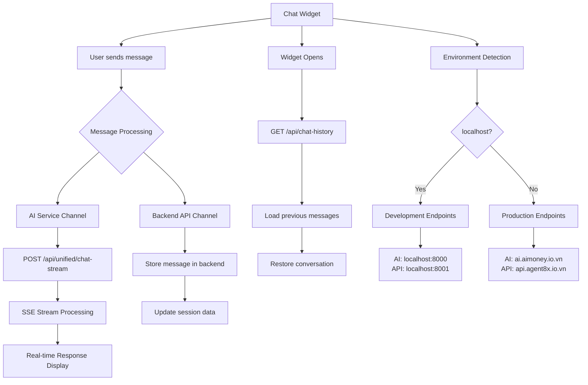

# Chat Plugin AI Service Integration Guide

---

**Last Updated:** August 13, 2025
**Plugin Version:** AI Service Integration v1.0 với Chat History Management
**Features:** Auto Environment Detection, SSE Streaming, MarkdownRenderer, ChatHistoryManager, Device Fingerprinting

## Tổng quan

Chat Plugin Agent8X sử dụng **AI Service** thay vì WebSocket để cung cấp trải nghiệm chat streaming với hiệu suất cao và độ tin cậy tốt hơ

Plugin được thiết kế theo kiến trúc **hybrid** với 2 luồng xử lý song song:

### 🤖 **AI Service Integration** (Real-time Chat)
- **Protocol**: HTTP POST với Server-Sent Events (SSE) streaming
- **Endpoint**: `/api/unified/chat-stream`
- **Purpose**: Xử lý tin nhắn real-time và trả về streaming responses
- **Features**: Language detection, Intent recognition, Content streaming

### 📚 **Backend API Integration** (Chat History)
- **Protocol**: REST API (GET/POST)
- **Endpoint**: `/api/chat-history/*`
- **Purpose**: Load/save chat history, session management
- **Features**: Message persistence, Device tracking, Session restoration

Plugin tự động detect môi trường (dev/prod) và route requests đến đúng endpoints, đảm bảo seamless experience cho users với chat history persistent và real-time AI responses.

## Kiến trúc Plugin

### 🏗️ System Architecture Overview

```
┌─────────────────────────────────────────────────────────────────────────────┐
│                              Chat Plugin (Browser)                          │
├─────────────────────────────────────────────────────────────────────────────┤
│  ┌─────────────────┐    ┌─────────────────┐    ┌─────────────────┐          │
│  │  ChatWidget     │    │ ChatHistory     │    │ PluginAIChat    │          │
│  │   Component     │    │   Manager       │    │   Service       │          │
│  │                 │    │                 │    │                 │          │
│  │ • UI Rendering  │    │ • Load History  │    │ • Send Messages │          │
│  │ • User Input    │    │ • Save Messages │    │ • Stream Events │          │
│  │ • State Mgmt    │    │ • Device Track  │    │ • Parse SSE     │          │
│  └─────────────────┘    └─────────────────┘    └─────────────────┘          │
└─────────────────────────────────────────────────────────────────────────────┘
           │                         │                         │
           │ User Messages           │ Chat History            │ AI Requests
           │                         │                         │
           ▼                         ▼                         ▼
┌─────────────────┐    ┌─────────────────┐    ┌─────────────────┐
│   Backend API   │    │   Backend API   │    │   AI Service    │
│   (Messages)    │    │ (Chat History)  │    │   (Streaming)   │
│                 │    │                 │    │                 │
│ • Store msgs    │    │ • GET /chat-    │    │ • POST /chat-   │
│ • Session mgmt  │    │   history       │    │   stream        │
│ • User tracking │    │ • Session data  │    │ • SSE streaming │
│                 │    │ • Device ID     │    │ • Language/     │
│                 │    │   tracking      │    │   Intent detect │
└─────────────────┘    └─────────────────┘    └─────────────────┘
```

### 🔄 Dual-Channel Architecture



### 🚀 Complete Processing Flow

#### 1️⃣ **Widget Initialization Flow**
```
Plugin Load → Environment Detection → Endpoint Configuration
     ↓
Device ID Generation → Session ID Creation → History Manager Init
     ↓
Load Chat History (if exists) → Display Previous Messages → Ready for Chat
```

#### 2️⃣ **Real-time Chat Flow**
```
User Input → Message Validation → AI Service Request
     ↓
POST /api/unified/chat-stream → SSE Stream Processing → UI Updates
     ↓
Language/Intent Detection → Content Streaming → Message Completion
     ↓
Store Final Message → Update Session → Ready for Next Message
```

#### 3️⃣ **Chat History Flow**
```
Widget Open → Check Device ID → Query Backend API
     ↓
GET /api/chat-history?deviceId={id} → Parse Sessions → Flatten Messages
     ↓
Sort by Timestamp → Convert to UI Format → Display with Separators
     ↓
Add Restoration Notice → Continue with New Conversation
```

#### 4️⃣ **Error Handling Flow**
```
Network Error → Retry Logic → Fallback Message → User Notification
     ↓
Stream Error → Stop Processing → Error Message → Reset State
     ↓
History Error → Silent Handling → Empty State → Continue Normally
```

### 🌐 Network Communication Patterns

```
┌─────────────────┐    HTTP POST     ┌─────────────────┐
│   Chat Plugin   │ ──────────────── │   AI Service    │
│   (Browser)     │    Streaming     │   AI Server     │
└─────────────────┘                  └─────────────────┘
        │                                     │
        │ Server-Sent Events (SSE)            │
        │ ← data: {"type":"content"}          │
        │ ← data: {"type":"language"}         │
        │ ← data: {"type":"intent"}           │
        │ ← data: {"type":"done"}             │
        └─────────────────────────────────────┘

┌─────────────────┐    GET/POST      ┌─────────────────┐
│   Chat Plugin   │ ──────────────── │  Backend API    │
│   (Browser)     │    REST API      │    BE Server    │
└─────────────────┘                  └─────────────────┘
        │                                     │
        │ GET /api/chat-history               │
        │ POST /api/chat-history/mark-read    │
        │ ← JSON Response                     │
        └─────────────────────────────────────┘

### 📊 Data Flow & State Management

```
┌─────────────────────────────────────────────────────────────────────────────┐
│                           Plugin State Management                           │
├─────────────────────────────────────────────────────────────────────────────┤
│                                                                             │
│  ┌─────────────────┐    ┌─────────────────┐    ┌─────────────────┐          │
│  │   UI State      │    │  Session State  │    │  Message State  │          │
│  │                 │    │                 │    │                 │          │
│  │ • isOpen        │    │ • deviceId      │    │ • messages[]    │          │
│  │ • isLoading     │    │ • sessionId     │    │ • streaming     │          │
│  │ • theme         │    │ • companySlug   │    │ • history       │          │
│  │ • position      │    │ • userInfo      │    │ • currentMsg    │          │
│  └─────────────────┘    └─────────────────┘    └─────────────────┘          │
│                                                                             │
└─────────────────────────────────────────────────────────────────────────────┘
              │                        │                        │
              ▼                        ▼                        ▼
    ┌─────────────────┐    ┌─────────────────┐    ┌─────────────────┐
    │ Widget Render   │    │ Session Persist │    │ Message Display │
    │                 │    │                 │    │                 │
    │ • Component     │    │ • localStorage  │    │ • MarkdownRender│
    │ • Styling       │    │ • deviceId      │    │ • Streaming UI  │
    │ • Interactions  │    │ • sessionData   │    │ • History UI    │
    └─────────────────┘    └─────────────────┘    └─────────────────┘
```

## 1. Khởi tạo Plugin

### 1.1 Environment Detection

Plugin tự động detect môi trường và chọn endpoint:

```typescript
// pluginAiChatService.ts
constructor() {
    const isDevelopment = window.location.hostname === 'localhost' ||
        window.location.hostname === '127.0.0.1' ||
        window.location.hostname.includes('dev');

    this.baseURL = isDevelopment
        ? 'http://localhost:8000'        // Development
        : 'https://ai.aimoney.io.vn';    // Production

    console.log('🤖 Plugin AI Service configured:', {
        baseURL: this.baseURL,
        environment: isDevelopment ? 'development' : 'production',
        autoDetectedEndpoint: true
    });
}
```

### 1.2 Widget Configuration

```html
<!-- Embed Code Example -->
<script type="module">
  import('https://static.agent8x.io.vn/dist/plugin/agent8x-widget.js')
    .then(() => {
      window.Agent8XWidget.init({
        companySlug: 'mermaidseaside',
        companyId: '1e789800-b402-41b0-99d6-2e8d494a3beb',
        pluginId: 'cf13a2ac-ed12-45fd-8290-44a0caa2bf83',
        domain: 'mermaidseaside.com',
        position: 'bottom-right',
        theme: 'light',
        brandColor: '#0EA5E9',
        autoOpen: true,
        language: 'VIETNAMESE',
        welcomeMessage: 'Xin chào! Tôi có thể hỗ trợ gì cho bạn?'
      });
    });
</script>
```

## 2. Session Management & Device Fingerprinting

### 2.1 Device ID Generation

Plugin sử dụng browser fingerprinting để tạo device ID persistent:

```typescript
private generateDeviceId(): string {
    // Kiểm tra localStorage trước
    const cachedDeviceId = localStorage.getItem('browser_device_id');
    if (cachedDeviceId) return cachedDeviceId;

    // Canvas fingerprinting
    const canvas = document.createElement('canvas');
    const ctx = canvas.getContext('2d');
    if (ctx) {
        ctx.textBaseline = 'top';
        ctx.font = '14px Arial';
        ctx.fillText('Agent8X Plugin fingerprint', 2, 2);
    }

    // Combine multiple fingerprint sources
    const fingerprint = canvas.toDataURL() +
        navigator.userAgent +
        navigator.language +
        screen.width + 'x' + screen.height;

    // Generate hash
    let hash = 0;
    for (let i = 0; i < fingerprint.length; i++) {
        const char = fingerprint.charCodeAt(i);
        hash = ((hash << 5) - hash) + char;
        hash = hash & hash;
    }

    const deviceId = `browser_${Math.abs(hash).toString(36)}`;
    localStorage.setItem('browser_device_id', deviceId);

    return deviceId;
}
```

### 2.2 Session ID Format

```typescript
private generateSessionId(companyId: string, deviceId: string): string {
    return `chat_session_${companyId}_${deviceId}`;
}
```

### 2.3 User ID for Anonymous Users

```typescript
private generateUserId(deviceId: string): string {
    return `anon_${deviceId.substring(0, 8)}`;
}
```

## 3. AI Service Communication

### 3.1 Chat Stream Endpoint

**URL:** `POST /api/unified/chat-stream`

**Headers:**
```typescript
const headers = {
    'Content-Type': 'application/json',
    'X-Company-Id': companyId  // Optional company header
};
```

### 3.2 Complete Payload Structure

```typescript
interface PluginStreamChatPayload {
    message: string;
    message_id: string;
    company_id: string;
    session_id: string;
    industry: string;
    language: 'vi' | 'en';
    channel: 'chat-plugin';  // Always 'chat-plugin' for plugin
    user_info: {
        user_id: string;
        device_id: string;
        source: 'web_device';
        name: string | null;
        email: string | null;
        is_authenticated: boolean;
    };
    context: {
        platform_data: {
            browser: string;
            operating_system: string;
            user_agent: string;
            platform: 'plugin';
            language: string;
            timezone: string;
        };
        context_data: {
            page_url: string;
            referrer: string | null;
            session_duration_minutes: number;
            page_views: number;
        };
        metadata: {
            app_source: 'agent8x-plugin';
            app_version: '1.0.0';
            request_id: string;
            api_version: 'v1';
            plugin_id?: string;
            company_slug?: string;
        };
    };
}
```

### 3.3 Payload Building Example

```typescript
// Ví dụ payload thực tế khi user gửi tin nhắn
const buildPayload = (message: string, pluginConfig: WidgetConfig): PluginStreamChatPayload => {
    const timestamp = Date.now();
    const deviceId = this.generateDeviceId();
    const companyId = pluginConfig.companyId || pluginConfig.companySlug;

    return {
        message: "Tôi muốn đặt phòng cho 2 người vào cuối tuần này",
        message_id: "msg_1723567890123_a8b9c2d3",
        company_id: "1e789800-b402-41b0-99d6-2e8d494a3beb",
        session_id: "chat_session_1e789800-b402-41b0-99d6-2e8d494a3beb_browser_k8n9m2p1",
        industry: "hotel",
        language: "vi",
        channel: "chat-plugin",
        user_info: {
            user_id: "anon_k8n9m2p1",
            device_id: "browser_k8n9m2p1x4z7y3",
            source: "web_device",
            name: null,
            email: null,
            is_authenticated: false
        },
        context: {
            platform_data: {
                browser: "Chrome 119",
                operating_system: "macOS",
                user_agent: "Mozilla/5.0 (Macintosh; Intel Mac OS X 10_15_7)...",
                platform: "plugin",
                language: "vi-VN",
                timezone: "Asia/Ho_Chi_Minh"
            },
            context_data: {
                page_url: "https://mermaidseaside.com/rooms",
                referrer: "https://google.com",
                session_duration_minutes: 5,
                page_views: 3
            },
            metadata: {
                app_source: "agent8x-plugin",
                app_version: "1.0.0",
                request_id: "req_1723567890123_x1y2z3",
                api_version: "v1",
                plugin_id: "cf13a2ac-ed12-45fd-8290-44a0caa2bf83",
                company_slug: "mermaidseaside"
            }
        }
    };
};
```

## 4. Server-Sent Events (SSE) Streaming

### 4.1 Stream Processing

```typescript
async streamChat(message: string, pluginConfig: WidgetConfig): Promise<void> {
    const payload = this.buildPayload(message, pluginConfig);

    console.log('🌐 Plugin calling AI service:', `${this.baseURL}/api/unified/chat-stream`);
    console.log('📤 Plugin payload:', payload);

    const response = await fetch(`${this.baseURL}/api/unified/chat-stream`, {
        method: 'POST',
        headers: {
            'Content-Type': 'application/json',
            'X-Company-Id': payload.company_id
        },
        body: JSON.stringify(payload),
    });

    if (!response.ok) {
        throw new Error(`HTTP error! status: ${response.status}`);
    }

    // Process SSE stream
    const reader = response.body?.getReader();
    if (!reader) throw new Error('Failed to get response reader');

    while (true) {
        const { done, value } = await reader.read();
        if (done) break;

        // Decode chunk
        const chunk = this.decoder.decode(value, { stream: true });
        const lines = chunk.split('\n');

        for (const line of lines) {
            if (line.startsWith('data: ')) {
                const eventData = line.substring(6);

                if (eventData === '[DONE]') {
                    console.log('✅ Stream completed');
                    return;
                }

                try {
                    const event: PluginStreamEvent = JSON.parse(eventData);
                    this.handleStreamEvent(event);
                } catch (error) {
                    console.error('❌ Error parsing stream event:', error);
                }
            }
        }
    }
}
```

### 4.2 Stream Event Types

```typescript
interface PluginStreamEvent {
    type: 'language' | 'intent' | 'content' | 'done' | 'error';
    language?: string;
    intent?: string;
    confidence?: number;
    content?: string;
    delta?: string;
    error?: string;
    metadata?: any;
}
```

### 4.3 Stream Event Processing

```typescript
private handleStreamEvent(event: PluginStreamEvent): void {
    switch (event.type) {
        case 'language':
            console.log('🗣️ Language detected:', event.language);
            break;

        case 'intent':
            console.log('🎯 Intent recognized:', event.intent, `(${event.confidence}%)`);
            break;

        case 'content':
            // Full content replacement
            if (event.content) {
                this.onStreamContent?.(event.content, false);
            }
            // Delta content (streaming)
            if (event.delta) {
                this.onStreamContent?.(event.delta, true);
            }
            break;

        case 'done':
            console.log('✅ Stream processing completed');
            this.onStreamDone?.();
            break;

        case 'error':
            console.error('❌ Stream error:', event.error);
            this.onStreamError?.(event.error || 'Unknown error');
            break;
    }
}
```

## 5. Content Rendering với MarkdownRenderer

### 5.1 MarkdownRenderer Implementation

Plugin sử dụng MarkdownRenderer tương tự chatdemo để render content:

```typescript
const MarkdownRenderer: React.FC<{ content: string; isDark?: boolean }> = ({ content, isDark }) => {
    const formatMarkdown = (text: string): JSX.Element[] => {
        // Split by double newlines để tạo paragraphs
        const paragraphs = text.split(/\n\s*\n/);
        const elements: JSX.Element[] = [];
        let currentKey = 0;

        const formatInlineText = (text: string): JSX.Element => {
            // Handle bold text (**text**)
            const boldRegex = /\*\*(.*?)\*\*/g;
            const parts = text.split(boldRegex);

            return (
                <span>
                    {parts.map((part, index) => {
                        if (index % 2 === 1) {
                            return (
                                <strong
                                    key={index}
                                    style={{
                                        fontWeight: 600,
                                        color: isDark ? '#ffffff' : '#111827'
                                    }}
                                >
                                    {part}
                                </strong>
                            );
                        }
                        return <span key={index}>{part}</span>;
                    })}
                </span>
            );
        };

        paragraphs.forEach((paragraph) => {
            const lines = paragraph.split('\n');
            let listItems: string[] = [];
            let isInList = false;

            lines.forEach((line) => {
                const trimmed = line.trim();
                if (!trimmed) return;

                // Headers
                if (trimmed.startsWith('###')) {
                    const headerText = trimmed.replace(/^###\s*/, '');
                    elements.push(
                        <h3 key={`h3-${currentKey++}`} style={{
                            fontSize: '1.125rem',
                            fontWeight: 600,
                            marginTop: '16px',
                            marginBottom: '8px',
                            color: isDark ? '#ffffff' : '#111827',
                            borderBottom: `1px solid ${isDark ? '#374151' : '#e5e7eb'}`,
                            paddingBottom: '4px'
                        }}>
                            {headerText}
                        </h3>
                    );
                }
                // List items
                else if (trimmed.startsWith('-') || trimmed.startsWith('•')) {
                    const listItem = trimmed.replace(/^[-•]\s*/, '');
                    listItems.push(listItem);
                    isInList = true;
                }
                // Regular text
                else {
                    elements.push(
                        <p key={`p-${currentKey++}`} style={{
                            lineHeight: '1.6',
                            marginBottom: '8px',
                            color: isDark ? '#e5e7eb' : '#374151'
                        }}>
                            {formatInlineText(trimmed)}
                        </p>
                    );
                }
            });

            // Flush remaining list
            if (listItems.length > 0) {
                elements.push(
                    <ul key={`list-${currentKey++}`} style={{
                        listStyle: 'disc',
                        paddingLeft: '20px',
                        marginBottom: '12px',
                        lineHeight: '1.6'
                    }}>
                        {listItems.map((item, index) => (
                            <li key={index} style={{
                                marginBottom: '4px',
                                color: isDark ? '#e5e7eb' : '#374151'
                            }}>
                                {formatInlineText(item)}
                            </li>
                        ))}
                    </ul>
                );
            }
        });

        return elements;
    };

    return (
        <div style={{ maxWidth: '100%' }}>
            {formatMarkdown(content)}
        </div>
    );
};
```

### 5.2 Message Display với Streaming

```typescript
const ChatWidget: React.FC<{ config: WidgetConfig }> = ({ config }) => {
    const [messages, setMessages] = useState<Message[]>([]);
    const [streamingMessage, setStreamingMessage] = useState<string>('');
    const [isStreaming, setIsStreaming] = useState(false);

    // Handle streaming content
    const handleStreamContent = (content: string, isDelta: boolean) => {
        if (isDelta) {
            // Append delta to streaming message
            setStreamingMessage(prev => prev + content);
        } else {
            // Replace entire streaming message
            setStreamingMessage(content);
        }
        setIsStreaming(true);
    };

    // Handle stream completion
    const handleStreamDone = () => {
        if (streamingMessage) {
            // Add final message to chat
            const finalMessage: Message = {
                id: Date.now().toString(),
                role: 'assistant',
                content: streamingMessage,
                timestamp: new Date()
            };

            setMessages(prev => [...prev, finalMessage]);
            setStreamingMessage('');
        }
        setIsStreaming(false);
    };

    // Render messages
    return (
        <div className="messages-container">
            {messages.map((message) => (
                <div key={message.id} className={`message ${message.role}`}>
                    <div className="message-content">
                        <MarkdownRenderer
                            content={message.content}
                            isDark={config.theme === 'dark'}
                        />
                    </div>
                    <div className="timestamp">
                        {message.timestamp.toLocaleTimeString()}
                    </div>
                </div>
            ))}

            {/* Streaming message */}
            {isStreaming && (
                <div className="message assistant streaming">
                    <div className="message-content">
                        <MarkdownRenderer
                            content={streamingMessage}
                            isDark={config.theme === 'dark'}
                        />
                        <span className="streaming-cursor">▌</span>
                    </div>
                </div>
            )}
        </div>
    );
};
```

## 6. Chat History Management

Plugin tích hợp **ChatHistoryManager** để tự động load và restore chat history từ backend API, giúp user có thể tiếp tục conversation khi quay lại trang web.

### 6.1 ChatHistoryManager Architecture

```typescript
// Chat History Manager for plugin - direct API calls to backend
class ChatHistoryManager {
    private companySlug: string;
    private deviceId: string;

    constructor(companySlug: string, deviceId: string) {
        this.companySlug = companySlug;
        this.deviceId = deviceId;
    }
}
```

**Key Features:**
- 🔄 **Auto-restore**: Tự động load previous conversations khi widget mở
- 📜 **Message flattening**: Flatten messages từ multiple sessions thành single timeline
- 🎯 **API integration**: Direct call đến backend API (không qua AI service)
- 📱 **Device-based**: Tracking theo deviceId, không cần authentication

### 6.2 Load Chat History Implementation

```typescript
// Load chat history from API - direct call to backend
async loadChatHistory(limit: number = 50): Promise<any[]> {
    try {
        const params = new URLSearchParams({
            companySlug: this.companySlug,
            deviceId: this.deviceId,
            page: '1',
            limit: limit.toString()
        });

        // Direct call to backend API
        const response = await fetch(`https://api.agent8x.io.vn/api/chat-history?${params}`, {
            method: 'GET',
            headers: {
                'Content-Type': 'application/json',
                'Origin': window.location.origin
            }
        });

        if (!response.ok) {
            throw new Error(`HTTP ${response.status}: ${response.statusText}`);
        }

        const data = await response.json();

        if (data.success && data.data && data.data.chatHistory) {
            console.log('📜 Chat history loaded:', data.data.chatHistory.length, 'sessions');

            // Extract all messages from all sessions and flatten them
            const allMessages: any[] = [];
            data.data.chatHistory.forEach((session: any) => {
                if (session.messages && Array.isArray(session.messages)) {
                    session.messages.forEach((msg: any) => {
                        allMessages.push({
                            ...msg,
                            sessionId: session.sessionId // Keep session reference
                        });
                    });
                }
            });

            // Sort messages by timestamp (oldest first)
            allMessages.sort((a, b) => new Date(a.timestamp).getTime() - new Date(b.timestamp).getTime());

            console.log('📧 Total messages extracted:', allMessages.length);
            return allMessages;
        }

        return [];
    } catch (error) {
        // Silent handling - no error messages for missing or empty history
        console.debug('💭 No chat history found or failed to load (this is normal for new sessions)');
        return [];
    }
}
```

### 6.3 History Restoration Flow

```typescript
// Load chat history function in ChatWidget
const loadChatHistory = async () => {
    if (!historyManagerRef.current) return;

    try {
        setIsLoadingHistory(true);

        // Get recent messages (up to 50 latest messages)
        const recentMessages = await historyManagerRef.current.getRecentMessages(50);

        if (recentMessages && recentMessages.length > 0) {
            console.log('🔄 Restoring chat history:', recentMessages.length, 'messages');

            // Generate proper message IDs for history messages
            const timestamp = Date.now();

            // Add restoration notice
            setMessages(prev => [...prev, {
                id: `msg_${timestamp}_${Math.random().toString(36).substr(2, 8)}`,
                role: 'assistant',
                content: config.language === 'VIETNAMESE'
                    ? `📜 Khôi phục ${recentMessages.length} tin nhắn trước...`
                    : `📜 Restoring ${recentMessages.length} previous messages...`,
                timestamp: new Date(),
                isError: false
            }]);

            // Convert and add historical messages
            const historicalMessages: Message[] = recentMessages.map((msg: any, index: number) => {
                const msgTimestamp = Date.now() + index + 1;
                const randomId = Math.random().toString(36).substr(2, 8);

                return {
                    id: `msg_${msgTimestamp}_${randomId}`, // ✅ Proper format
                    role: msg.type === 'user' ? 'user' : 'assistant',
                    content: msg.content,
                    timestamp: new Date(msg.timestamp)
                };
            });

            setMessages(prev => [...prev, ...historicalMessages]);

            // Add separator for new messages
            const separatorTimestamp = Date.now() + recentMessages.length + 2;
            setMessages(prev => [...prev, {
                id: `msg_${separatorTimestamp}_${Math.random().toString(36).substr(2, 8)}`,
                role: 'assistant',
                content: config.language === 'VIETNAMESE'
                    ? '--- Tiếp tục cuộc trò chuyện ---'
                    : '--- Continue conversation ---',
                timestamp: new Date(),
                isError: false
            }]);
        }
    } catch (error) {
        // Silent handling - no error messages for missing or empty history
        console.debug('💭 No chat history found (this is normal for new users or sessions)');
    } finally {
        setIsLoadingHistory(false);
    }
};
```

### 6.4 Integration với Widget Lifecycle

```typescript
// Initialize Chat History Manager
useEffect(() => {
    if (!historyManagerRef.current && config.companySlug) {
        const deviceId = chatServiceRef.current?.getDeviceId() || 'plugin-device-unknown';
        historyManagerRef.current = new ChatHistoryManager(config.companySlug, deviceId);
        console.log('✅ Chat History Manager initialized');
    }
}, [config.companySlug]);

// Load chat history on widget open
useEffect(() => {
    if (isOpen && historyManagerRef.current) {
        // Use the comprehensive loadChatHistory function
        loadChatHistory();
    }
}, [isOpen]);
```

### 6.5 Message ID Format Consistency

Plugin đảm bảo tất cả messages (bao gồm history) đều có format ID nhất quán:

```typescript
// ✅ Proper message ID format for all messages
const generateMessageId = (): string => {
    const timestamp = Date.now();
    const randomId = Math.random().toString(36).substr(2, 8);
    return `msg_${timestamp}_${randomId}`;
};

// Usage examples:
// User message: msg_1692105000000_abc12345
// AI response: msg_1692105001000_def67890
// History message: msg_1692105002000_ghi34567
// System message: msg_1692105003000_jkl89012
```

### 6.6 Chat History API Response Format

Backend API trả về structure theo specification:

```json
{
  "success": true,
  "data": {
    "chatHistory": [
      {
        "sessionId": "session_chat-plugin_aia_1692105000000",
        "companyInfo": {
          "id": "aia-company-uuid-2024",
          "name": "AIA Insurance",
          "slug": "aia"
        },
        "deviceId": "browser_abc123",
        "messages": [
          {
            "id": "msg_001",
            "type": "user",
            "content": "Xin chào, tôi muốn hỏi về bảo hiểm",
            "timestamp": "2024-08-10T10:00:00.000Z",
            "isRead": true
          },
          {
            "id": "msg_002",
            "type": "ai",
            "content": "Chào bạn! Tôi là AI assistant của AIA...",
            "timestamp": "2024-08-10T10:00:15.000Z",
            "isRead": false
          }
        ],
        "startedAt": "2024-08-10T10:00:00.000Z",
        "lastActivity": "2024-08-10T10:05:30.000Z",
        "messageCount": 8
      }
    ],
    "pagination": {
      "current": 1,
      "limit": 50,
      "total": 3,
      "pages": 1
    }
  }
}
```

### 6.7 Error Handling & Graceful Fallback

```typescript
// Silent error handling - không hiển thị error cho user
catch (error) {
    // Silent handling - no error messages for missing or empty history
    console.debug('💭 No chat history found (this is normal for new users or sessions)');
    return [];
}

// Graceful fallback - nếu không có history, widget vẫn hoạt động bình thường
if (recentMessages && recentMessages.length > 0) {
    // Restore history
} else {
    // Continue with empty state - show welcome message
}
```

## 7. Example Response Parsing

### 7.1 Typical AI Service Response

```
data: {"type":"language","language":"vi"}

data: {"type":"intent","intent":"hotel_booking","confidence":95}

data: {"type":"content","delta":"Chào bạn! "}

data: {"type":"content","delta":"Tôi hiểu bạn muốn đặt phòng "}

data: {"type":"content","delta":"cho **2 người** vào cuối tuần này.\n\n"}

data: {"type":"content","delta":"### Các lựa chọn phòng phù hợp:\n\n"}

data: {"type":"content","delta":"- **Deluxe Ocean View**: 2,500,000 VND/đêm\n"}

data: {"type":"content","delta":"- **Premium Suite**: 3,200,000 VND/đêm\n"}

data: {"type":"content","delta":"- **Family Room**: 2,800,000 VND/đêm\n\n"}

data: {"type":"content","delta":"Bạn có muốn tôi kiểm tra tình trạng phòng trống không?"}

data: {"type":"done"}

data: [DONE]
```

### 7.2 Final Rendered Content

Plugin sẽ parse và render thành:

```
Chào bạn! Tôi hiểu bạn muốn đặt phòng cho **2 người** vào cuối tuần này.

### Các lựa chọn phòng phù hợp:

- **Deluxe Ocean View**: 2,500,000 VND/đêm
- **Premium Suite**: 3,200,000 VND/đêm
- **Family Room**: 2,800,000 VND/đêm

Bạn có muốn tôi kiểm tra tình trạng phòng trống không?
```

## 8. Error Handling

### 8.1 Network Errors

```typescript
try {
    await this.aiService.streamChat(message, this.pluginConfig);
} catch (error) {
    console.error('💥 AI Service error:', error);

    // Show user-friendly error message
    const errorMessage: Message = {
        id: Date.now().toString(),
        role: 'assistant',
        content: this.pluginConfig.language === 'VIETNAMESE'
            ? 'Xin lỗi, đã có lỗi xảy ra. Vui lòng thử lại sau.'
            : 'Sorry, an error occurred. Please try again later.',
        timestamp: new Date(),
        isError: true
    };

    setMessages(prev => [...prev, errorMessage]);
}
```

### 8.2 Stream Errors

```typescript
case 'error':
    console.error('❌ Stream error:', event.error);
    setIsStreaming(false);
    setStreamingMessage('');

    // Add error message to chat
    const errorMsg: Message = {
        id: Date.now().toString(),
        role: 'assistant',
        content: 'Đã có lỗi xảy ra trong quá trình xử lý. Vui lòng thử lại.',
        timestamp: new Date(),
        isError: true
    };
    setMessages(prev => [...prev, errorMsg]);
    break;
```

## 9. Performance Optimization

### 9.1 Message Throttling

```typescript
// Limit streaming updates to avoid UI lag
const throttledUpdateStream = useMemo(
    () => throttle((content: string) => {
        setStreamingMessage(content);
    }, 50), // Update every 50ms
    []
);
```

### 9.2 Memory Management

```typescript
// Clean up old messages to prevent memory leaks
useEffect(() => {
    if (messages.length > 100) {
        setMessages(prev => prev.slice(-50)); // Keep last 50 messages
    }
}, [messages.length]);
```

## 10. Testing & Debugging

### 10.1 Console Logging

Plugin cung cấp detailed logging cho debugging:

```
🤖 Plugin AI Service configured: {baseURL: "https://ai.aimoney.io.vn", environment: "production"}
🌐 Plugin calling AI service: https://ai.aimoney.io.vn/api/unified/chat-stream
📤 Plugin payload: {message: "Hello", company_id: "1e789800..."}
🗣️ Language detected: vi
🎯 Intent recognized: greeting (98%)
✅ Stream completed
```

### 10.2 Local Testing

```javascript
// Override endpoint for local testing
window.Agent8XWidget.init({
    // ... other config
    apiEndpoint: 'http://localhost:8000' // Local AI service
});
```

## 10. Production Deployment

### 10.1 CDN Integration

Plugin được deploy tự động lên CDN:

```html
<script src="https://static.agent8x.io.vn/dist/plugin/agent8x-widget.js"></script>
```

### 10.2 CORS Configuration

AI Service cần configure CORS cho cross-domain requests:

```typescript
// Server CORS headers
{
    "Access-Control-Allow-Origin": "*",
    "Access-Control-Allow-Methods": "POST, OPTIONS",
    "Access-Control-Allow-Headers": "Content-Type, X-Company-Id"
}
```

---

## Kết luận

Chat Plugin Agent8X sử dụng **AI Service** với **SSE streaming** để cung cấp trải nghiệm chat real-time mượt mà. Plugin tự động handle:

- 🔄 **Environment detection**: Tự động detect dev/prod endpoints
- 💬 **Session management**: Device fingerprinting và session tracking
- 📜 **Chat history**: Auto-restore previous conversations từ backend API
- 🎨 **Content rendering**: MarkdownRenderer advanced với dark/light theme
- ⚡ **Performance**: Streaming responses với throttling và memory management

Plugin đảm bảo **compatibility cao** và **performance tối ưu** cho mọi website với khả năng tích hợp seamless và user experience consistent.
