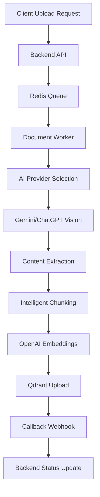

# 📁 File Upload Integration Guide - Complete Backend & AI Service Flow

## 📋 Overview

This document provides a comprehensive guide for integrating the complete file upload workflow between:
- **Backend API**: Handles file upload requests and task management 
- **Redis Queue**: Manages async task processing
- **Document Processing Worker**: Processes files with AI providers
- **Qdrant Vector Database**: Stores processed content for RAG search
- **Callback System**: Notifies backend of processing completion

## 🏗️ System Architecture



## 🔄 Complete API Flow

### **Step 1: File Upload Request**

**Endpoint:** `POST /api/admin/companies/{companyId}/files/upload`

**Headers:**
```http
Content-Type: application/json
X-API-Key: agent8x-backend-secret-key-2025
```

**Request Body:**
```json
{
  "r2_url": "https://static.agent8x.io.vn/company/{companyId}/files/{fileId}.txt",
  "data_type": "document",
  "industry": "insurance",
  "metadata": {
    "original_name": "insurance_policy_guide.txt",
    "file_id": "53497412-aa73-49dc-8e24-d22a59655d91",
    "file_name": "insurance_policy_guide.txt",
    "file_size": 1024,
    "file_type": "text/plain",
    "uploaded_by": "user123",
    "description": "Insurance policy guidelines document",
    "tags": ["insurance", "policy", "guidelines"],
    "language": "vi"
  },
  "upload_to_qdrant": true,
  "callback_url": "https://your-backend.com/api/webhooks/file-processing-complete"
}
```

**Response (Success):**
```json
{
  "success": true,
  "message": "File upload task queued successfully",
  "task_id": "a112d10b-34f7-4a97-a28d-1c046a0d443f",
  "status": "pending",
  "status_check_url": "/api/admin/tasks/document/a112d10b-34f7-4a97-a28d-1c046a0d443f/status"
}
```

### **Step 2: Background Processing**

**Queue System:**
- Task added to Redis queue: `document_processing`
- Worker picks up task asynchronously
- Processing status: `pending` → `processing` → `completed` / `failed`

**AI Provider Selection Logic:**
```python
# Automatic provider selection based on file type
if file_type in ["image/jpeg", "image/png", "image/gif", "image/webp"]:
    provider = "chatgpt_vision"  # GPT-4V for image analysis
else:
    provider = "gemini"  # Gemini 1.5 Pro for documents
```

**Processing Steps:**
1. **File Download**: Fetch content from R2 URL
2. **Content Extraction**: Use selected AI provider with professional Vietnamese prompts
3. **Intelligent Chunking**: 2-3 page chunks with structure preservation
4. **Embedding Generation**: OpenAI text-embedding-3-small (1536 dimensions)
5. **Qdrant Upload**: Store with comprehensive metadata
6. **Status Update**: Update task status to completed
7. **Callback Notification**: Send webhook to backend (when implemented)

### **Step 3: Task Status Monitoring**

**Endpoint:** `GET /api/admin/tasks/document/{taskId}/status`

**Response:**
```json
{
  "task_id": "a112d10b-34f7-4a97-a28d-1c046a0d443f",
  "status": "completed",
  "created_at": "2025-07-25T16:25:20.732339",
  "updated_at": "2025-07-25T16:25:26.000270",
  "worker_id": "doc-worker-001",
  "processing_time": 5.27,
  "data": {
    "chunksCreated": 1,
    "processingTime": 5.271128177642822
  }
}
```

**Status Values:**
- `pending`: Task queued, waiting for worker
- `processing`: Worker is actively processing the file
- `completed`: Processing finished successfully
- `failed`: Processing encountered an error

### **Step 4: File Status Verification**

**Endpoint:** `GET /api/admin/companies/{companyId}/files/{fileId}/status`

**Response (Success):**
```json
{
  "file_found": true,
  "collection": "multi_company_data",
  "points_found": {
    "total": 1,
    "by_company": 1
  },
  "file_details": {
    "file_id": "53497412-aa73-49dc-8e24-d22a59655d91",
    "company_id": "9a974d00-1a4b-4d5d-8dc3-4b5058255b8f",
    "tags": ["insurance", "policy", "guidelines"],
    "data_type": "document",
    "industry": "insurance",
    "language": "vi",
    "original_name": "insurance_policy_guide.txt",
    "upload_timestamp": "2025-07-25T16:25:25.999Z"
  }
}
```

## 📞 Callback Webhook Implementation

### **Webhook Endpoint Requirements**

**Backend should implement:** `POST /api/webhooks/file-processing-complete`

**Webhook Payload:**
```json
{
  "event": "file.uploaded",
  "companyId": "9a974d00-1a4b-4d5d-8dc3-4b5058255b8f",
  "data": {
    "fileId": "53497412-aa73-49dc-8e24-d22a59655d91",
    "taskId": "a112d10b-34f7-4a97-a28d-1c046a0d443f",
    "status": "completed",
    "processedAt": "2025-07-25T16:25:26.003907",
    "tags": ["insurance", "policy", "guidelines"],
    "chunksCreated": 1,
    "processingTime": 5.271128177642822,
    "qdrantCollection": "multi_company_data",
    "vectorDimensions": 1536,
    "embeddingModel": "text-embedding-3-small"
  },
  "timestamp": "2025-07-25T16:25:26.003919"
}
```

**Expected Response:**
```json
{
  "success": true,
  "message": "File processing notification received"
}
```

### **Backend Webhook Handler Example**

```python
@app.post("/api/webhooks/file-processing-complete")
async def handle_file_processing_complete(payload: dict):
    """Handle file processing completion webhook"""
    try:
        event_data = payload.get("data", {})
        company_id = payload.get("companyId")
        file_id = event_data.get("fileId")
        status = event_data.get("status")
        
        # Update file record in database
        await db.files.update_one(
            {"file_id": file_id, "company_id": company_id},
            {
                "$set": {
                    "processing_status": status,
                    "processed_at": event_data.get("processedAt"),
                    "chunks_created": event_data.get("chunksCreated"),
                    "processing_time": event_data.get("processingTime"),
                    "qdrant_collection": event_data.get("qdrantCollection"),
                    "vector_ready": True
                }
            }
        )
        
        # Notify frontend if needed (WebSocket, Server-Sent Events, etc.)
        await notify_frontend(company_id, {
            "type": "file_processed",
            "fileId": file_id,
            "status": status
        })
        
        return {"success": True, "message": "File processing notification received"}
        
    except Exception as e:
        logger.error(f"Webhook processing failed: {e}")
        return {"success": False, "error": str(e)}
```

## 🔧 Configuration Requirements

### **Environment Variables**

**Required for AI Service Integration:**
```bash
# OpenAI Configuration
OPENAI_API_KEY=your_openai_api_key_here
EMBEDDING_MODEL=text-embedding-3-small
VECTOR_SIZE=1536

# Google Gemini Configuration  
GOOGLE_API_KEY=your_google_api_key_here
GEMINI_MODEL=gemini-1.5-pro-latest

# Qdrant Configuration
QDRANT_URL=http://localhost:6333
QDRANT_API_KEY=your_qdrant_api_key_here
UNIFIED_COLLECTION_NAME=multi_company_data

# Redis Configuration
REDIS_URL=redis://localhost:6379
REDIS_QUEUE_NAME=document_processing

# Internal API Authentication
INTERNAL_API_KEY=agent8x-backend-secret-key-2025
```

### **Qdrant Collection Setup**

**Collection Configuration:**
```python
# Collection will be auto-created with these settings:
{
    "collection_name": "multi_company_data",
    "vectors_config": {
        "size": 1536,  # OpenAI text-embedding-3-small dimensions
        "distance": "Cosine"
    },
    "payload_index": {
        "file_id": "keyword",  # Enables efficient file filtering
        "company_id": "keyword",
        "data_type": "keyword",
        "industry": "keyword",
        "language": "keyword"
    }
}
```

## 🎯 Professional AI Prompts

### **Document Extraction Prompt (Vietnamese)**
```python
VIETNAMESE_DOCUMENT_EXTRACTION_PROMPT = """
Bạn là chuyên gia phân tích tài liệu tiếng Việt với khả năng trích xuất thông tin chuyên nghiệp và chính xác.

NHIỆM VỤ: Trích xuất và tóm tắt nội dung chính từ tài liệu được cung cấp.

YÊU CẦU CHẤT LƯỢNG:
1. 🎯 CHÍNH XÁC: Trích xuất thông tin đúng với nội dung gốc
2. 📝 ĐẦY ĐỦ: Không bỏ sót thông tin quan trọng  
3. 🔗 CẤU TRÚC: Giữ nguyên cấu trúc logic của tài liệu
4. 🌍 NGÔN NGỮ: Sử dụng tiếng Việt chuẩn, chuyên nghiệp
5. 📊 CHI TIẾT: Bao gồm số liệu, điều kiện, quy định cụ thể

ĐỊNH DẠNG KẾT QUẢ:
- Sử dụng tiêu đề rõ ràng để phân chia nội dung
- Liệt kê thông tin quan trọng theo dạng danh sách  
- Giữ nguyên các con số, tỷ lệ, phần trăm
- Bảo toàn thuật ngữ chuyên môn và pháp lý

HÃY TRÍCH XUẤT TOÀN BỘ NỘI DUNG QUAN TRỌNG TỪ TÀI LIỆU SAU:
"""
```

### **Image Analysis Prompt (Vietnamese)**
```python
VIETNAMESE_IMAGE_ANALYSIS_PROMPT = """
Bạn là chuyên gia phân tích hình ảnh và tài liệu quét với khả năng nhận diện văn bản tiếng Việt chính xác.

NHIỆM VỤ: Phân tích hình ảnh và trích xuất toàn bộ văn bản có trong ảnh.

YÊU CẦU CHẤT LƯỢNG:
1. 👁️ NHẬN DIỆN: Đọc chính xác tất cả văn bản trong ảnh
2. 📝 CHUYỂN ĐỔI: Chuyển đổi thành văn bản có cấu trúc
3. 🔗 BỐ CỤC: Giữ nguyên layout và thứ tự thông tin
4. 🌍 NGÔN NGỮ: Nhận diện và xử lý tiếng Việt có dấu  
5. 📊 CHI TIẾT: Bao gồm bảng biểu, số liệu, ký hiệu

ĐỊNH DẠNG KẾT QUẢ:
- Transcribe toàn bộ văn bản theo thứ tự từ trên xuống dưới
- Giữ nguyên cấu trúc bảng biểu (nếu có)
- Phân biệt tiêu đề, nội dung, ghi chú
- Bảo toàn dấu câu và định dạng số

HÃY PHÂN TÍCH VÀ TRÍCH XUẤT TOÀN BỘ NỘI DUNG TỪ HÌNH ẢNH SAU:
"""
```

## 🧪 Testing & Validation

### **Test Script Usage**

**Run End-to-End Test:**
```bash
cd /Users/user/Code/ai-chatbot-rag
python test_file_upload_workflow.py
```

**Test Flow Validation:**
1. ✅ API Upload Request
2. ✅ Redis Queue Processing  
3. ✅ AI Content Extraction
4. ✅ Qdrant Vector Storage
5. ✅ Status Updates
6. ⏳ Callback Webhook (pending backend implementation)

### **Expected Log Output**

**Successful Processing:**
```log
INFO:src.workers.document_processing_worker:🎯 Selected AI provider: gemini for file type: text/plain
INFO:src.workers.document_processing_worker:📄 Extracted content: 139-150 characters
INFO:src.workers.document_processing_worker:📊 Created 1 intelligent chunks  
INFO:chatbot:✅ Upserted 1 points to collection multi_company_data
INFO:src.workers.document_processing_worker:✅ Successfully uploaded 1 chunks
INFO:src.workers.document_processing_worker:✅ Task completed in 5.27s
INFO:src.workers.document_processing_worker:✅ Task status updated to completed
INFO:src.workers.document_processing_worker:📞 Callback data prepared (HTTP call disabled)
```

## 🚨 Error Handling

### **Common Error Scenarios**

**1. File Not Found (404)**
```json
{
  "success": false,
  "error": "File not found at R2 URL",
  "task_id": "task-uuid",
  "status": "failed"
}
```

**2. AI Provider Error**
```json
{
  "success": false,
  "error": "AI provider failed to extract content",
  "provider": "gemini",
  "task_id": "task-uuid",
  "status": "failed"
}
```

**3. Qdrant Connection Error**
```json
{
  "success": false,
  "error": "Failed to connect to Qdrant vector database",
  "task_id": "task-uuid", 
  "status": "failed"
}
```

**4. Vector Dimension Mismatch**
```json
{
  "success": false,
  "error": "Vector dimension mismatch: expected 1536, got 768",
  "task_id": "task-uuid",
  "status": "failed"
}
```

### **Error Recovery Mechanisms**

**Automatic Retry Logic:**
- AI provider failures: 3 retries with exponential backoff
- Qdrant upload failures: 2 retries with collection recreation
- Embedding generation failures: 2 retries with different chunk sizes

**Error Notifications:**
- Failed tasks trigger callback with `status: "failed"`
- Detailed error messages in task status endpoint
- Comprehensive logging for debugging

## 🔄 Backend Integration Steps

### **Step 1: Implement Callback Webhook**

**Create webhook endpoint in your backend:**
```python
# Example: FastAPI implementation
@app.post("/api/webhooks/file-processing-complete")
async def file_processing_webhook(payload: FileProcessingWebhook):
    # Update file status in database
    # Notify frontend via WebSocket/SSE
    # Trigger any post-processing workflows
    pass
```

### **Step 2: Enable Callback in Worker**

**Uncomment HTTP callback code in worker:**
```python
# In src/workers/document_processing_worker.py
# Uncomment lines 575-594 to enable HTTP callback
```

### **Step 3: Configure Authentication**

**Set proper API key for webhook calls:**
```python
headers = {
    "Content-Type": "application/json",
    "X-Internal-API-Key": "your_actual_backend_api_key",
    "Authorization": "Bearer your_webhook_token"  # if needed
}
```

### **Step 4: Test Integration**

**Verify webhook receives proper data:**
1. Deploy webhook endpoint
2. Enable callback in worker
3. Test file upload
4. Confirm webhook receives notification
5. Validate database updates

## 📊 Monitoring & Analytics

### **Key Metrics to Track**

**Processing Performance:**
- Average processing time per file type
- Success/failure rates by AI provider  
- Queue processing latency
- Qdrant upload performance

**Business Metrics:**
- Files processed per company
- Popular file types and industries
- Error patterns and resolution times
- User satisfaction with extraction quality

### **Logging Best Practices**

**Structured Logging Format:**
```python
logger.info(
    "Task completed",
    extra={
        "task_id": task.task_id,
        "company_id": task.company_id,
        "file_type": task.metadata.get("file_type"),
        "processing_time": processing_time,
        "chunks_created": len(chunks),
        "ai_provider": selected_provider
    }
)
```

## 🎯 Production Deployment Checklist

### **Pre-Deployment**
- [ ] Environment variables configured
- [ ] Redis cluster operational
- [ ] Qdrant cluster configured with proper resources
- [ ] AI provider API keys valid and funded
- [ ] Webhook endpoint implemented and tested
- [ ] SSL certificates configured for secure callbacks

### **Post-Deployment**
- [ ] Monitor processing queue length
- [ ] Verify Qdrant index performance
- [ ] Test callback delivery success rates
- [ ] Monitor AI provider usage and costs
- [ ] Set up alerting for failed processing tasks

---

**🚀 This integration enables seamless file processing with industry-leading AI providers, intelligent content chunking, and robust vector storage for optimal RAG search performance.**
